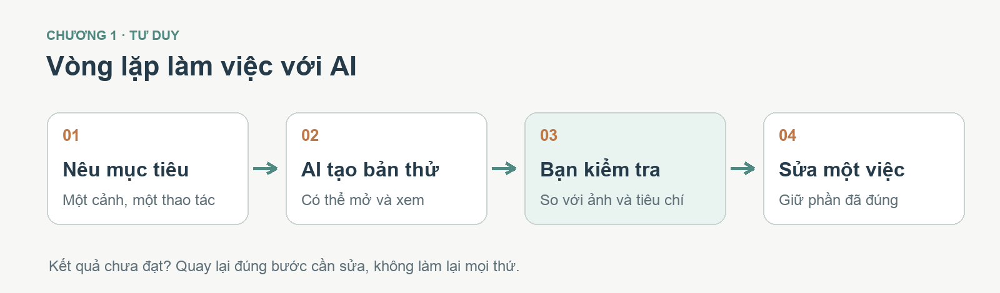
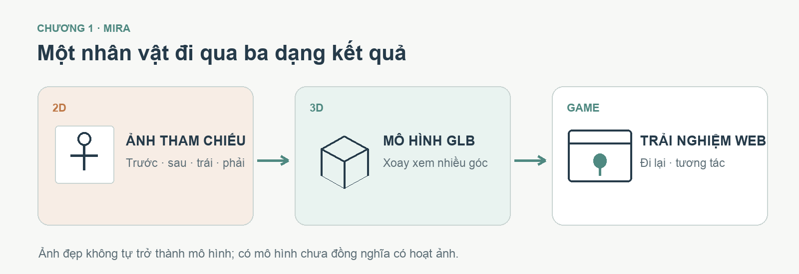
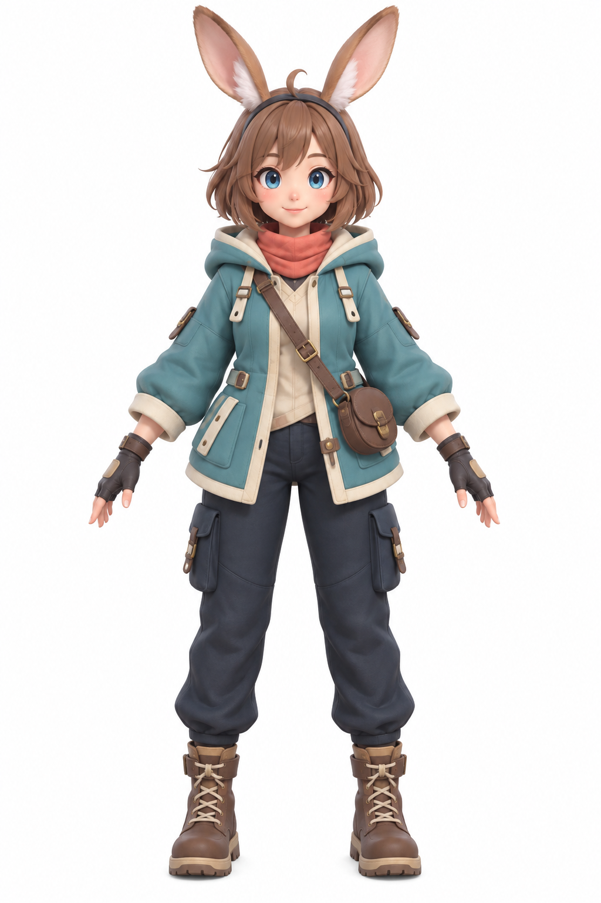
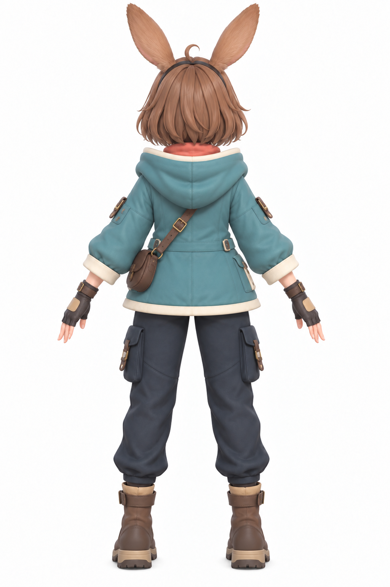
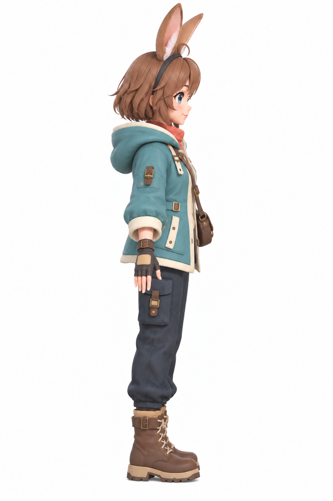
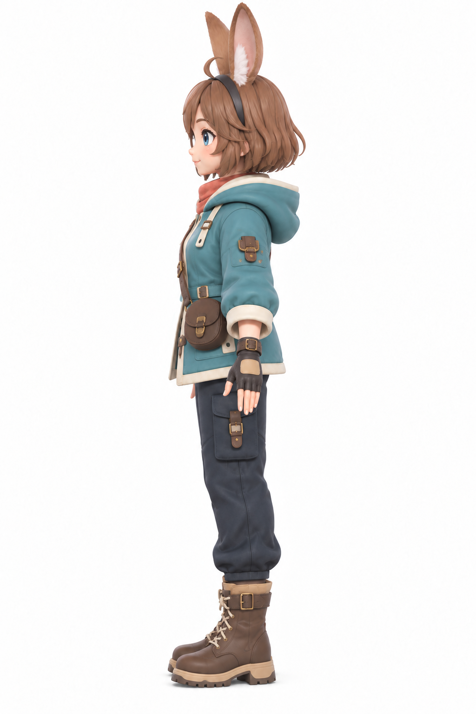
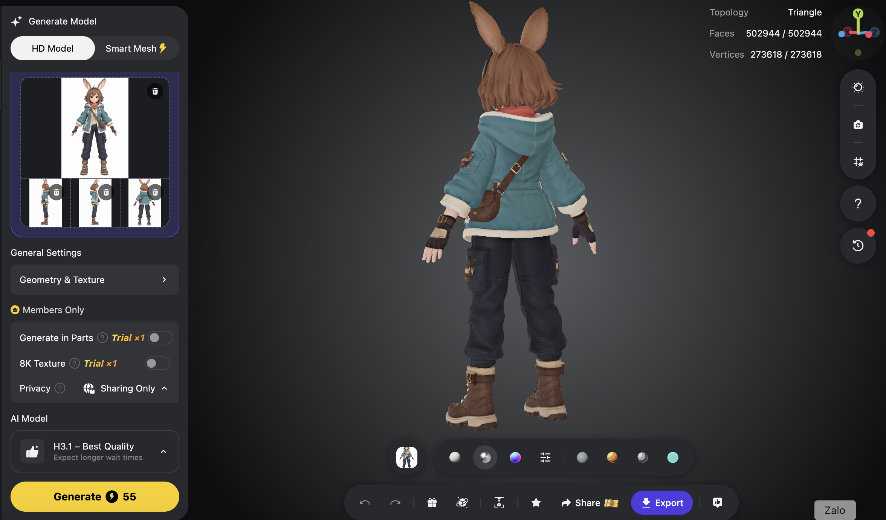

# Chương 1 — Tư duy Vibe Code 3D: bạn định hướng, AI thực hiện

Bạn có thể mô tả một trang web bằng vài câu và nhờ AI viết mã. Với 3D, cách bắt đầu cũng như vậy, nhưng phần cần kiểm tra nhiều hơn: hình có đúng không, nhìn từ góc khác có còn đúng không, mô hình có quá nặng không, và nó có thực sự chuyển động được không? Chương này giúp bạn hiểu vai trò của mình trước khi cài công cụ hay học thuật ngữ.

**Sau chương này, bạn có thể:** chọn một ý tưởng 3D vừa sức; giao một nhiệm vụ rõ ràng cho AI; nhìn kết quả để quyết định bước tiếp theo; phân biệt ảnh nhân vật, mô hình 3D và nhân vật có hoạt ảnh.

## 1.1. Vibe coding là gì?

Vibe coding là cách làm sản phẩm bằng ngôn ngữ tự nhiên: bạn nói mục tiêu và yêu cầu, một agent lập trình tạo file, chạy thử và sửa lỗi cùng bạn. *Agent* là trợ lý có thể làm việc với dự án, không chỉ trả lời trong ô chat. Bạn không cần tự gõ từng dòng mã để làm bản đầu tiên, nhưng vẫn là người quyết định sản phẩm cần làm gì và khi nào đã đạt.

Hãy nghĩ đến việc làm một căn phòng trưng bày. Bạn có thể nhờ một đội thi công dựng phòng, đặt đèn và treo sản phẩm. Nếu bạn chỉ nói “làm thật đẹp”, mỗi người có thể hình dung một kiểu. Nếu bạn đưa ảnh mẫu, kích thước, nơi đặt sản phẩm và cách khách đi xem, đội thi công sẽ có cơ sở để làm đúng hơn. Agent lập trình cũng cần những chỉ dẫn như vậy.

Với một dự án 3D, câu “Tạo một game thật đẹp” chưa cho AI biết nhân vật là ai, người chơi làm gì, game chạy ở đâu và thế nào là xong. Một yêu cầu dễ thực hiện hơn là:

> Tạo một cảnh 3D nhỏ chạy trên trình duyệt. Nhân vật đứng trên một hòn đảo, người chơi dùng phím hoặc nút trên điện thoại để đi đến một viên pha lê. Chạm vào pha lê thì hiện “Đã tìm thấy”. Trước tiên chỉ làm một màn chơi; cho tôi xem bản chạy được rồi mới thêm hiệu ứng.

Yêu cầu thứ hai có **đối tượng, hành động, môi trường và điểm dừng**. Nhờ đó, bạn có thể kiểm tra kết quả thay vì chỉ cảm thấy “có vẻ chưa đúng”.

> **Điểm cần nhớ:** AI tạo bản đầu tiên rất nhanh. “Đã hiện trên màn hình” chưa đồng nghĩa “đã hoàn thiện”. Bạn cần xem, thử và mô tả điều cần sửa.

## 1.2. Thế giới 3D khác một trang web thông thường ở đâu?

Một trang thông tin thường có chữ, ảnh, nút và các khối nội dung. Cảnh 3D còn có chiều sâu. Vật thể có mặt trước, sau, trái, phải; ánh sáng và góc nhìn có thể làm cùng một vật trông rất khác.

Hãy hình dung một sân khấu:

```text
SÂN KHẤU 3D (scene)
├─ Đạo cụ, nhân vật       → mô hình (model)
├─ Hình dạng đạo cụ       → hình học (geometry/mesh)
├─ Màu và bề mặt          → vật liệu, ảnh bề mặt (material/texture)
├─ Đèn                   → ánh sáng (light)
└─ Máy quay               → camera

Trình duyệt vẽ cảnh → bạn nhìn và thử → nói điều cần sửa → AI chỉnh lại
```

Bạn chưa cần học hết tên gọi ở đây. Chỉ cần nhớ: khi một nhân vật nhìn “sai”, nguyên nhân có thể nằm ở **mô hình**, **ảnh bề mặt**, **ánh sáng** hoặc **camera**. Ví dụ, giày trông méo có thể do phần hình của giày thật sự sai; đổi camera đẹp hơn không sửa được lỗi đó. Chương 2 sẽ giải thích từng thuật ngữ bằng hình và ví dụ.

## 1.3. Bắt đầu từ ứng dụng nào?

3D có ích khi người xem cần **quan sát nhiều góc** hoặc **tương tác** với đối tượng. Bạn không cần bắt đầu bằng một game lớn.

| Ứng dụng | Người xem làm gì? | Bản đầu tiên vừa sức |
|---|---|---|
| Landing page sản phẩm 3D | Xoay để xem hình dạng, màu hoặc chi tiết | Một mô hình, một thao tác xoay, phần mô tả dễ đọc |
| Mô hình trực quan trên website | Khám phá không gian, chọn một vị trí để xem thông tin | Một cảnh, vài điểm bấm có chú thích |
| Game 3D đơn giản | Di chuyển, tìm hoặc nhặt một vật | Một nhân vật, một màn chơi, một mục tiêu |

Nếu người xem chỉ cần thấy một khoảnh khắc đẹp, **ảnh hoặc video có thể đã đủ**. Chọn 3D khi việc xoay, đi lại hoặc chạm vào mô hình giúp họ hiểu thêm điều mà ảnh tĩnh không thể hiện được.

Ví dụ xuyên suốt mười chương đầu là **game Mira**: từ ảnh nhân vật, mô hình Tripo, bản game đã chơi được tới việc gắn xương và tạo chuyển động. Chương 11 mở một dự án độc lập để áp dụng cùng cách làm cho landing page 3D.

## 1.4. PROMPT là chưa đủ: bạn cần biết mình đang duyệt điều gì

Một prompt hay không bù được ảnh đầu vào sai hoặc một mô hình thiếu bộ phận. Bạn cũng không cần trở thành lập trình viên hay họa sĩ 3D. Điều cần làm là **đặt tiêu chí quan sát được**.

Trong một dự án nhỏ, phần việc có thể chia như sau:

| Bạn quyết định | AI hỗ trợ |
|---|---|
Ai sẽ dùng sản phẩm và họ làm việc gì | Đề xuất cấu trúc và tạo bản đầu tiên |
Ảnh, phong cách và chi tiết nào phải giữ | Tạo ảnh tham chiếu hoặc đưa mô hình vào cảnh |
Kết quả nào đạt, chi tiết nào sai | Tìm nguyên nhân và sửa phần được chỉ rõ |
Khi nào nên dừng để kiểm tra | Chạy thử, chụp kết quả, báo điều đã làm |

Quy trình ngắn nhất là:



*Hình 1.1 — Một vòng làm việc nên tạo ra thứ có thể xem, rồi chỉ sửa phần chưa đạt. Giữ nguyên những phần đã đúng giúp bạn tránh làm lại không cần thiết.*

```text
Nêu một việc rõ ràng
       ↓
AI tạo một kết quả có thể xem
       ↓
Bạn so với mục tiêu và ảnh tham chiếu
       ↓
Chỉ sửa một nhóm vấn đề
       ↺ Lặp lại đến khi đạt
```

Ví dụ, nếu mặt nhân vật đúng nhưng giày sai, hãy nói “giữ mặt, tóc và áo; chỉ kiểm tra hình dáng hai chiếc giày” thay vì “làm lại nhân vật cho đẹp”. Câu thứ hai có thể khiến những phần đang đúng cũng thay đổi.

## 1.5. Năm bước tạo một nhân vật anime cho game 3D

Chúng ta dùng **Mira**, một nhân vật thám hiểm tai thỏ theo phong cách anime dễ thương. Trang phục gồm áo khoác rộng, khăn quàng, quần dài và giày bốt. Bản game đầu tiên đã được tạo từ một lệnh lớn. Ở phần thực hành, ta tách từng đầu vào để thấy chúng làm kết quả thay đổi ra sao và biết cách phát triển game tiếp.



*Hình 1.2 — Cùng một nhân vật nhưng có ba dạng kết quả. Mỗi dạng cần một công cụ và một cách kiểm tra khác nhau.*

**Bước 1 — Chốt thiết kế từ mặt trước bằng ChatGPT.**

**Mục tiêu:** tạo một ảnh nhân vật dễ nhận diện và có trang phục rõ ràng.  
**Prompt có thể dùng ngay:**

> Thiết kế một nữ thám hiểm phong cách anime/chibi cho game hành động nhẹ nhàng. Nhân vật có tóc nâu ngắn, mắt xanh, tai thỏ cách điệu, áo khoác xanh ngọc rộng, khăn màu san hô, quần dài, găng tay và giày bốt. Trang phục kín đáo, không gợi cảm. Vẽ toàn thân nhìn chính diện, đứng cân bằng, hai tay tách nhẹ khỏi thân, nền trắng. Giữ các chi tiết đủ đơn giản để có thể dựng thành mô hình 3D.



*Hình 1.3 — Ảnh 2D chính diện của Mira do ChatGPT tạo. Duyệt tai, mặt, áo khoác và hai chiếc bốt trước khi yêu cầu góc nhìn khác.*

Đây là **ảnh 2D**, chưa phải mô hình 3D.  
**Cách kiểm tra:** nhìn rõ cả hai giày, hai tay, tai thỏ, màu áo và túi đeo; không có phần nào bị cắt khỏi khung. Nếu ảnh thiếu chân hoặc bàn tay, sửa ảnh trước khi đi tiếp.

**Bước 2 — Tạo mặt sau của cùng nhân vật.**

**Mục tiêu:** để công cụ 3D không phải tự đoán toàn bộ phía sau.  
**Prompt có thể dùng ngay:**

> Dựa trên ảnh chính diện tôi gửi, hãy tạo **mặt sau của đúng nhân vật này**. Giữ chiều cao, tỷ lệ đầu và tai, tóc, áo khoác, túi, quần và giày nhất quán. Không thêm phụ kiện mới. Toàn thân, tư thế trung tính, nền trắng.



*Hình 1.4 — Ảnh 2D mặt sau dùng để kiểm mũ áo, túi, tóc và bốt có nhất quán với ảnh chính diện hay không.*

**Cách kiểm tra:** đặt hai ảnh cạnh nhau; đối chiếu chiều dài áo, màu khăn, vị trí dây túi và kiểu giày. AI có thể vẽ thêm một chi tiết hợp lý nhưng không có trong ảnh gốc; “trông hợp lý” vẫn chưa chắc là “cùng nhân vật”.

**Bước 3 — Hoàn thiện góc trái và phải.**

**Mục tiêu:** có một bộ ảnh nhiều góc để dựng 3D.  
**Prompt có thể dùng ngay:**

> Từ ảnh trước và sau đã duyệt, tạo thêm góc trái và góc phải của cùng nhân vật. Giữ tai, tóc, túi đeo, viền áo, chiều dài quần và giày nhất quán. Mỗi ảnh chỉ có một nhân vật toàn thân, đứng thẳng, nền trắng.



*Hình 1.5 — Góc trái của Mira: đối chiếu viền áo, túi và hình dáng bốt với ảnh chính diện.*



*Hình 1.6 — Góc phải của cùng nhân vật. Hai ảnh bên không nên tự xuất hiện phụ kiện hoặc kiểu giày mới.*

**Cách kiểm tra:** nhìn dải màu của áo, túi đeo và giày qua cả bốn ảnh. Nếu ảnh trái có kiểu bốt khác ảnh phải, hãy sửa bộ ảnh trước khi tạo 3D. Bốn ảnh không nhất quán có thể khiến công cụ dựng ra các chi tiết lạ.

**Bước 4 — Dựng và duyệt mô hình trong Tripo.**

**Mục tiêu:** chuyển bốn ảnh đã chọn thành một mô hình 3D có thể dùng trên web. Trong bản được tác giả chọn cho game, ảnh được nạp vào **Tripo Studio, chế độ Multi-view to 3D với HD Model H3.1**. Mô hình trong ảnh chụp có topology Triangle. Đây là một lần dựng khác với bản thử P1 trước đó; không gộp hai kết quả thành một.


*Hình 1.7 — Preview 3D của Mira trong Tripo Studio, nhìn từ phía trước. Mặt, tai, áo khoác và bốt đã có hình khối; đây là mô hình có thể xoay xem, không còn là ảnh 2D.*



*Hình 1.8 — Cùng mô hình Mira nhìn từ phía sau. Xoay sang góc này giúp kiểm tra tóc, mũ áo, dây túi và hai chiếc bốt mà ảnh chính diện không thể chứng minh.*

**Kết quả thực tế ở bản đầu:** mô hình giữ được các đặc điểm nhận diện chính. GLB đầu tiên đưa vào game có texture nhưng chưa có rig hoặc clip hoạt ảnh. Sau vòng thử này, tác giả đã làm Retopo và gắn xương cho Mira; Chương 7 theo sát bước nâng cấp đó. Giày đã rõ hơn bản thử cũ, vẫn cần xem cận cảnh hai bên trước khi coi asset là bản cuối.

**Cách kiểm tra:** xoay mô hình để nhìn cả trước, sau và hai bên; phóng to mặt, tay và giày; xem các bộ phận có bị dính hoặc méo không. Nếu một chi tiết sai, ghi lại đúng chi tiết đó. Đừng vội dùng mô hình trong game chỉ vì preview mặt trước trông đẹp.

> **Lưu ý về GLB:** File Mira hiện có hình và ảnh bề mặt, nhưng **không có bộ xương điều khiển (rig) hay hoạt ảnh chạy/nhảy**. GLB là một gói mô hình; nội dung bên trong mỗi file có thể khác nhau. Có file GLB không có nghĩa nhân vật đã chạy được.

**Bước 5 — Đưa nhân vật vào một game web nhỏ.**

Tác giả đã dùng một prompt rộng hơn với Claude Opus 5.5 để tạo **Mira · Đêm Linh Quang**, một game Three.js đã chơi được trên desktop và mobile. Prompt khởi đầu là:

> Tôi có file GLB của nhân vật Mira và muốn đưa vào một màn chơi 3D nhỏ trên web. Trước tiên hãy kiểm tra file có những phần nào, có rig hoặc hoạt ảnh không. Sau đó đặt nhân vật vào một cảnh game đồ họa đẹp, sử dụng Three.js và các công cụ cần thiết. Cho người chơi di chuyển bằng bàn phím hoặc nút chạm và nhặt một vật phát sáng. Có thể thêm vài loại yêu quái xuất hiện theo mức độ tăng dần và các chiêu thức để nhân vật chiến đấu. Tạo thư mục dự án; sau khi xong, mở localhost để tôi chơi thử.


*Hình 1.9 — Game thực tế trên desktop: Mira đứng trên đảo bay, đến tế đàn để nhặt Linh Tinh. Ảnh chụp này chứng minh bản chơi đầu đã có cảnh, nhân vật và mục tiêu tương tác.*


*Hình 1.10 — Cùng game trên màn hình điện thoại dọc. Cần điều khiển ảo và nút chiêu thức được bố trí cho thao tác chạm; ảnh chụp trình duyệt chưa thay thế việc thử trên điện thoại thật.*

**Điểm cần phân biệt:** Prompt này tạo ra **phiên bản game đầu tiên** có nhiều hệ thống nhưng chân tay Mira chưa cử động theo khớp. GLB đời đầu không có xương; mã khi ấy chỉ nhún, nghiêng hoặc xoay cả nhân vật. Repo được phát triển tiếp đã có Mira 65 xương và chuyển động dựng bằng mã; Chương 7 giải thích vì sao GIF preview trên Tripo chưa tự biến thành clip trong GLB xuất ra.

**Cách tự kiểm:** nhân vật hiện đủ người, không chìm xuống nền; phím/nút di chuyển hoạt động; chạm vật thì có phản hồi. Chương 7 hướng dẫn nâng cấp chuyển động, Chương 10 hướng dẫn kiểm lại toàn bộ vòng chơi.

### Bài học rút ra từ năm bước

Ở bước 1–3, ChatGPT giúp chuẩn bị **ảnh đầu vào**. Bước 4, Tripo tạo **mô hình 3D**. Bước 5, agent lập trình dùng **mô hình đó trong một trải nghiệm web**. Mỗi công cụ giải quyết một việc khác nhau. Khi giày của bản 3D chưa đạt, người làm dự án phải nhận ra và quyết định sửa đầu vào, chỉnh asset hay chấp nhận giới hạn ở bản thử. Đó là tư duy quan trọng hơn một prompt dài.

## Bài tập 10 phút: chọn dự án đầu tiên

Hãy chọn **một** trong ba hướng: mô hình sản phẩm xoay được, một góc tham quan có điểm bấm, hoặc game nhặt một vật. Viết một câu mô tả kết quả và ba dấu hiệu để biết bản đầu tiên đã đạt.

Bạn có thể đưa prompt này cho ChatGPT/Codex hoặc Claude:

> Tôi là người mới và muốn làm một bản mẫu 3D chạy trên trình duyệt trong một ngày. Ý tưởng của tôi là: [viết một câu]. Hãy giúp tôi thu hẹp thành phiên bản nhỏ nhất có thể xem và thử. Đề xuất tối đa ba tiêu chí “đạt”, những ảnh hoặc mô hình cần chuẩn bị, và thứ tự ba việc đầu tiên. Giải thích bằng ngôn ngữ dễ hiểu; chưa viết mã cho đến khi tôi chọn phương án.

**Tự kiểm tra:** Sau khi AI trả lời, bạn có hình dung được mình sẽ nhìn thấy gì trên màn hình ở lần chạy đầu tiên không? Nếu chưa, hãy yêu cầu mô tả lại bằng một cảnh và một thao tác cụ thể.

## Trước khi sang chương 2

- [ ] Tôi phân biệt được ảnh 2D, mô hình GLB và nhân vật có hoạt ảnh.
- [ ] Tôi chọn được một ứng dụng 3D nhỏ thay vì một dự án quá rộng.
- [ ] Tôi biết kiểm tra kết quả thật và nêu một chi tiết sai cụ thể.
- [ ] Tôi có một câu mô tả dự án cùng ba tiêu chí “đạt”.

Chương 2 sẽ giải thích những từ vừa xuất hiện — scene, camera, model, GLB, rig, Three.js — và cách chuẩn bị môi trường tối thiểu để bắt đầu.
