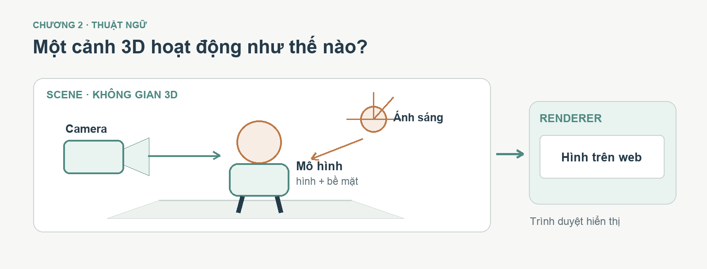
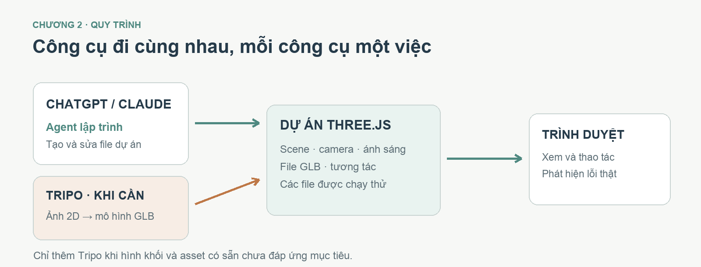

# Chương 2 — Đọc một game 3D bằng ngôn ngữ dễ hiểu

Chương 1 đã đưa Mira từ ảnh 2D sang mô hình rồi vào game. Bạn chỉ cần vài từ để nói chính xác phần nào cần sửa. Hãy nhìn game như một sân khấu có diễn viên, phông cảnh, máy quay và luật chơi.

**Sau chương này, bạn làm được:** gọi tên sáu thành phần quan trọng và biết file nào cần đưa cho agent khi muốn nâng cấp Mira.

*Hình 2.1 — Mira là một mô hình trong cảnh; camera quyết định góc nhìn, ánh sáng quyết định cách nhìn thấy bề mặt. Luật chơi và điều khiển là phần bổ sung để cảnh trở thành game.*

## 2.1. Sáu từ thật sự cần cho case Mira

| Từ | Hiểu bằng game Mira | Câu hỏi khi sửa |
|---|---|---|
| **GLB / asset** | File nhân vật 3D được đưa vào game | Có tải đúng bản Mira đã duyệt không? |
| **Scene / world** | Đảo bay, cỏ, cổng và tế đàn | Mục tiêu có dễ nhìn không? |
| **Camera** | “Máy quay” theo Mira | Có thấy nhân vật, quái và đường đi không? |
| **Texture / material** | Màu áo, bốt, độ bóng bề mặt | Sai màu ở file hay do ánh sáng game? |
| **Rig / clip** | Xương và động tác đứng, chạy, đánh | GLB có thật sự chứa chúng không? |
| **Three.js** | Công cụ vẽ cảnh và xử lý tương tác trên web | Agent đã mở bản chơi trên localhost chưa? |

**Localhost** là địa chỉ xem bản đang chạy trên máy làm việc, giống bản nháp chưa đưa lên mạng. **Repo** là thư mục dự án cùng lịch sử thay đổi. **Token** là đơn vị AI dùng khi đọc và trả lời; đưa cả lịch sử dài vào một lỗi nhỏ thường lãng phí hơn gửi ảnh lỗi và file liên quan.

Ở **phiên bản đầu**, GLB Mira có hình và màu nhưng không có rig hoặc clip; Three.js chỉ đổi vị trí cả model. Ở **repo mới nhất**, Mira có 65 xương nên chân có thể bước và tay có thể ra chiêu. File Tripo xuất ra vẫn không mang theo clip hoạt ảnh, vì vậy game tạo các động tác trên bộ xương bằng mã. Hai mốc này giúp bạn thấy “đi được” và “chân bước thật” là hai việc khác nhau.

## 2.2. Công cụ nào đã làm việc gì?

*Hình 2.2 — ChatGPT tạo ảnh nhiều góc, Tripo dựng GLB, agent lập trình ghép game bằng Three.js. Người làm dự án duyệt ở mỗi mốc.*

| Công cụ | Việc trong case này |
|---|---|
| **ChatGPT** | Tạo bộ ảnh Mira trước/sau/trái/phải và ảnh concept phát triển |
| **Tripo Studio** | Tạo model 3D từ ảnh, xoay preview, xuất GLB; có thể thử Auto Rig ở bước sau |
| **Claude hoặc Codex** | Đọc file, tạo/sửa repo game, chạy localhost và kiểm kết quả |
| **Three.js** | Hiển thị Mira, bối cảnh, quái, ánh sáng và hiệu ứng trong trình duyệt |

Game Mira mà tác giả cung cấp được tạo sau khi ông điều chỉnh prompt và chạy trên Claude Opus 5.5. Đây là **một quan sát của case**, không phải phép thử chứng minh model nào luôn tốt hơn. Ảnh đầu vào, file GLB, yêu cầu và cách duyệt đều ảnh hưởng kết quả.

## 2.3. Bắt đầu từ bản đang chạy

Bạn không cần tạo một thư mục game mới để học chương này. Hãy mở repo Mira đã có, nhờ agent đọc README và khởi chạy bản hiện tại. Đừng đưa mật khẩu hoặc khóa API vào prompt.

**Prompt thực hành:**

> Đây là thư mục game Mira đang chạy. Hãy đọc README và kiểm cấu trúc dự án, nhưng chưa sửa file. Chạy game trên localhost và cho tôi biết: file GLB nào đang dùng, phần nào tạo nhân vật, quái, chiêu thức và bối cảnh, cách mở bản desktop/mobile. Giải thích bằng lời đơn giản, mỗi phần một câu. Nếu không chạy được, báo đúng lỗi trước khi đề xuất sửa.

**Cách thử:** mở trang, nhìn thấy Mira và tế đàn, dùng bàn phím hoặc nút chạm di chuyển. **Nếu trang trắng:** đưa thông báo lỗi cho agent; yêu cầu kiểm asset và đường dẫn trước khi đổi thiết kế.

## 2.4. Giữ một tờ ghi chú dự án

Nhờ agent tạo một file ngắn ghi: **bản đang chạy**, **asset đang dùng**, **điều đã kiểm**, **một việc cần làm tiếp**. Ví dụ: “Mira đã chơi được trên desktop/mobile; GLB chưa rig; việc tiếp theo là thử idle/run/attack; giữ nguyên game hiện tại.” Tờ ghi chú này giúp phiên làm việc sau không bắt đầu lại từ số không.

**Prompt tiếp tục:** “Hãy đọc ghi chú dự án và bản game hiện tại. Nêu một việc nhỏ nên làm tiếp, file nào có thể phải thay, và cách tôi kiểm kết quả. Chưa sửa cho đến khi đã xác nhận phạm vi.”

## Trước khi sang chương 3

- [ ] Tôi phân biệt được asset, bối cảnh, camera và chuyển động.
- [ ] Tôi biết GLB có hình nhưng chưa chắc có xương.
- [ ] Tôi mở được bản game hiện tại trước khi giao nâng cấp.

Chương 3 sẽ dùng chính game Mira để chia một yêu cầu lớn thành các nhiệm vụ nhỏ.
