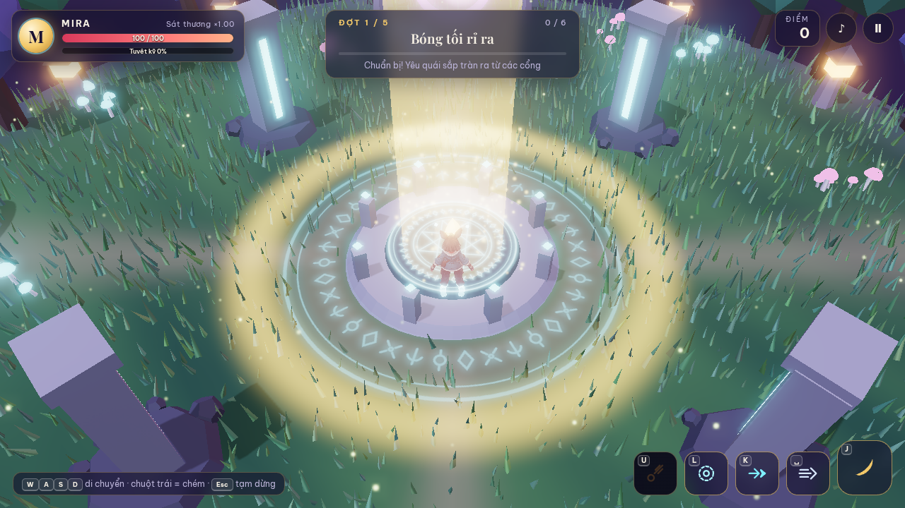
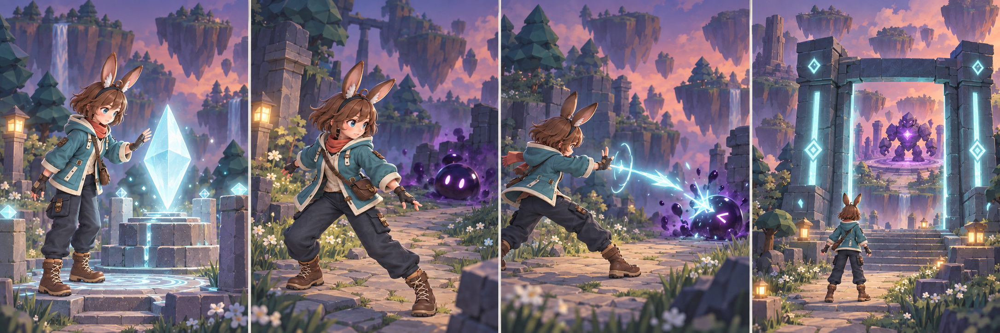
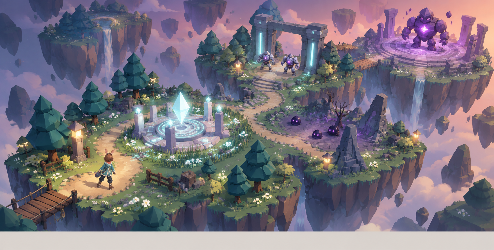
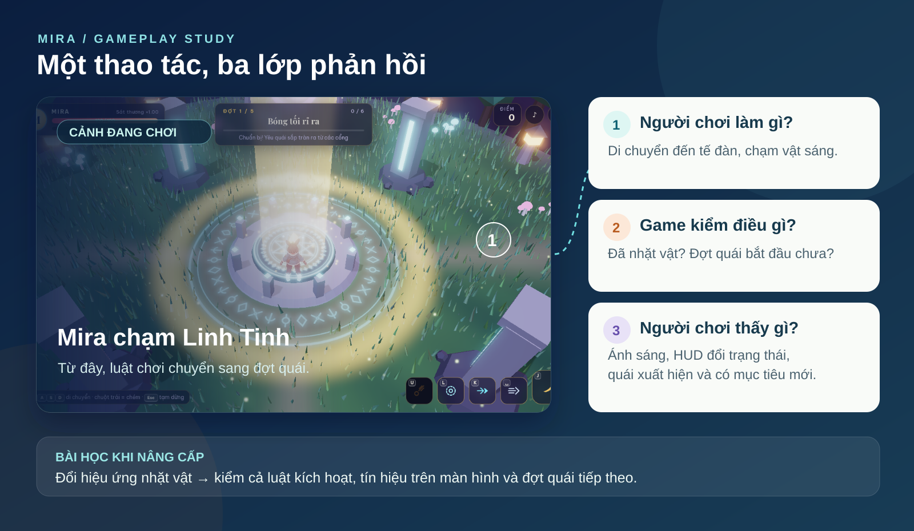

# Chương 3 — Từ một prompt đến kế hoạch phát triển game Mira

Ở Chương 1, một prompt đã giúp tạo **Mira · Đêm Linh Quang**: nhân vật trên đảo bay, nhặt Linh Tinh, đánh các đợt quái. Game chạy được. Chương này chỉ ra cách tách kết quả thành những việc nhỏ để nâng cấp mà không phá bản đang chơi.

**Sau chương này, bạn làm được:** kể lại vòng chơi bằng bốn cảnh, giải thích một thao tác được game xử lý thế nào, chọn một phần để cải tiến và giao việc cho ChatGPT/Codex hoặc Claude bằng câu lệnh có điểm dừng.

*Hình 3.1 — Bản chơi đã có nhân vật, mục tiêu nhặt vật, bối cảnh và giao diện. Bước tiếp theo là kiểm từng phần, không yêu cầu AI dựng lại toàn bộ.*

## 3.1. Một prompt tạo ra game, nhưng game gồm nhiều phần

Hãy nhìn ảnh game và hỏi: “Nếu thay đúng một thứ, tôi muốn thay gì trước?” Sáu phần dễ nhận ra là **nhân vật**, **chuyển động**, **quái**, **chiêu thức**, **bối cảnh** và **điều khiển**. Mira hiện đi được nhưng hai chân chưa bước riêng; đó là nhiệm vụ về nhân vật và chuyển động, không phải nhiệm vụ làm lại cả đảo bay.

| Phần đang có | Bản hiện tại | Một nâng cấp có thể kiểm |
|---|---|---|
| Mira | Bản đầu có hình đẹp nhưng chưa có xương; bản mới đã gắn 65 xương | Kiểm bước chân và chuyển động trong Xưởng của game; chỉ gọi là clip Tripo nếu file thật có clip |
| Quái | Hình khối dựng bằng Three.js | Dễ nhận ra loại yếu, loại bay và trùm |
| Chiêu thức | Chém, bắn, vòng sáng, lướt, tuyệt kỹ | Mỗi chiêu có hình ảnh và phản hồi riêng |
| Bối cảnh | Đảo bay, cổng, cỏ và tế đàn | Đường đi rõ; Mira không bị cảnh che khuất |
| Mobile | Cần ảo và nút chạm | Chơi được trên máy thật, nút không che nhân vật |

Trước khi thêm truyện mới, hãy xem **một vòng chơi đã có** qua năm ảnh thật. Người chơi nhìn hướng dẫn, nhặt Linh Tinh, đối mặt các đợt quái, đánh trùm và tới màn kết quả. Chuỗi này là khung xương để đặt thêm cốt truyện; thêm một cảnh mới phải giúp người chơi hiểu hoặc thực hiện một bước trong chuỗi.

*Hình 3.2 — Năm ảnh chụp game đang chạy, từ màn mở đầu tới màn kết quả. Đây là vòng chơi hiện có; các tranh concept bên dưới là đề xuất phát triển tiếp.*

## 3.2. Từ ảnh game thành câu chuyện bốn cảnh

Game đã có vòng chơi: tìm Linh Tinh, đối mặt các đợt quái và đánh trùm. Để phát triển bối cảnh truyện, trước tiên hãy kể lại **điều người chơi tự nhìn thấy và làm được**, rồi mới thêm chi tiết mới. Một hướng dễ hiểu là: Linh Tinh thức tỉnh tế đàn; bóng tối từ cổng tràn ra; Mira dùng ánh sáng mở đường; khi vượt qua trùm, cổng được thanh lọc. Đây là **đề xuất kể chuyện cho phiên bản tiếp theo**, không phải lời thoại hay nhiệm vụ đã có trong game.

*Hình 3.3 — Bốn khung concept: nhặt Linh Tinh → nhận ra quái → dùng phép phản công → tiến đến cổng trùm. Ảnh dùng để duyệt nhịp kể và bố cục; chúng không phải ảnh chụp game đang chạy.*

Mỗi cảnh chỉ cần trả lời hai câu: **Mira muốn gì?** và **người chơi phải làm gì để tiến tiếp?** Nếu một chi tiết truyện không thay đổi mục tiêu, đường đi hoặc cảm giác khi chơi, hãy để sau. Chẳng hạn, cổng phát sáng khi nhặt đủ Linh Tinh vừa kể được chuyện, vừa cho người chơi biết phải đi đâu.

*Hình 3.4 — Bản đồ concept một tuyến chơi: nơi bắt đầu, tế đàn, vùng quái nhỏ, cổng đá và đấu trường trùm. Đây là gợi ý bố trí không gian để duyệt, chưa phải bản đồ đã lập trình trong repo.*

**Bài tập 5 phút:** dùng ngón tay đi theo đường từ Mira tới cổng trong Hình 3.4. Nếu phải đoán lối đi, hãy yêu cầu làm rõ đường hoặc tín hiệu ánh sáng trong ảnh định hướng **trước** khi giao agent dựng cảnh 3D.

## 3.3. Một thao tác trong game hoạt động thế nào?

Khi Mira chạm Linh Tinh, có ba lớp liên tiếp: người chơi **di chuyển và chạm vật**; game **kiểm vật đã được nhặt và đợt quái cần bắt đầu**; màn hình **cho thấy ánh sáng, thông tin mới và quái xuất hiện**. Người mới không cần đọc hết mã để hiểu mối liên hệ này.

*Hình 3.5 — Ảnh chụp game thật được đặt cạnh ba câu hỏi kiểm: người chơi làm gì, game kiểm điều gì và người chơi thấy gì. Khi sửa một lớp, hãy thử lại cả vòng tương tác.*

**Thử trực tiếp:** mở game, tiến tới tế đàn và quan sát trước/sau khi nhặt. Ghi một câu về điều bạn bấm, một câu về điều màn hình thay đổi và một câu về điều bạn mong xảy ra tiếp. Ba câu ấy là nền cho prompt sửa tính năng.

## 3.4. Câu lệnh đầu tiên và câu lệnh tiếp theo khác nhau

Prompt đầu tiên cần mở được dự án và tạo vòng chơi. Prompt tiếp theo cần **giữ phần đã đạt** rồi sửa đúng một phần.

> Game Mira hiện đã chạy. Hãy đọc file GLB đang dùng và phần điều khiển nhân vật. Tôi muốn chân tay chuyển động thật khi Mira đứng, đi và chạy. Trước khi sửa, báo file có xương và clip hay không; nếu không có, đề xuất bước tạo asset phù hợp. Giữ nguyên ngoại hình, bối cảnh, quái và luật chơi. Chỉ sửa game sau khi đã có file hoạt ảnh kiểm được. Mở localhost và cho tôi xem Mira đứng, chạy, dừng theo cùng một góc camera.

**Mục tiêu:** thay hoạt ảnh nhân vật. **Cách thử:** đi thẳng, đổi hướng, dừng, nhìn cận hai chân và hai bốt. **Nếu lỗi:** quay về bản GLB và game trước khi sửa; ghi lỗi cụ thể như “chân xuyên nền”.

## 3.5. Mẫu giao việc bốn dòng

Bạn không phải viết một mega prompt cho mọi lần chỉnh. Hãy nói rõ **hiện có gì**, **muốn thay gì**, **phải giữ gì** và **đạt khi nào**.

Ví dụ với quái: “Hiện có ba loại quái bằng hình khối. Muốn thay riêng Slime Bóng Tối bằng thiết kế mới; giữ tốc độ, máu và cách đuổi hiện tại. Đạt khi tôi nhận ra nó từ xa, đòn đánh vẫn báo trước và game còn chạy trên mobile.” Câu này cho agent đủ tự do để làm hình nhưng không được tự ý đổi luật chơi.

## 3.6. Chia phiên làm việc theo kết quả xem được

Một trình tự cho bản nâng cấp Mira là: **kiểm GLB → duyệt dáng đứng/chạy → ghép hoạt ảnh → đổi một quái → nâng cấp một chiêu → thử desktop/mobile**. Mỗi bước phải có ảnh hoặc bản chạy để duyệt. Nếu dáng chạy chưa ổn, đừng chuyển sang làm phép thuật.

**Bài tập 10 phút:** chọn đúng một hàng trong bảng mục 3.1. Viết bốn câu “Hiện có / Muốn thay / Phải giữ / Đạt khi”. Mở game, chụp trạng thái hiện tại và gửi ảnh đó cho agent. Đây là điểm gốc để so trước và sau.

## Trước khi sang chương 4

- [ ] Tôi gọi tên được các phần của game Mira bằng lời thường.
- [ ] Tôi phân biệt ảnh concept kể chuyện với ảnh game đang chạy.
- [ ] Tôi mô tả được thao tác, luật kiểm và phản hồi của việc nhặt Linh Tinh.
- [ ] Tôi chọn một nâng cấp, không giao lại cả game.
- [ ] Prompt có điều phải giữ và dấu hiệu “đạt” nhìn thấy được.

Chương 4 dùng ảnh game thật để chỉ cách đánh giá kết quả bằng mắt và bằng thao tác.
