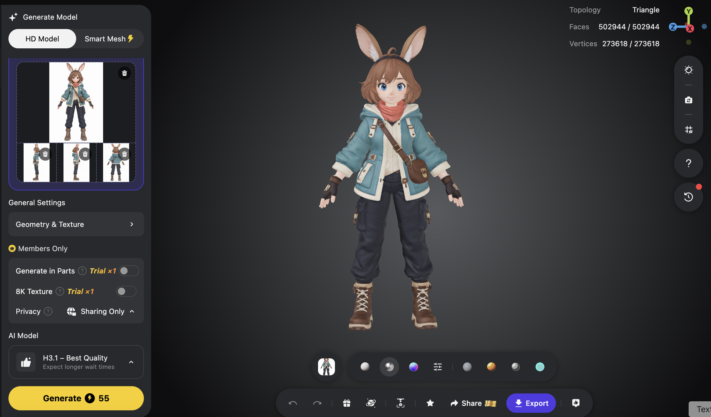
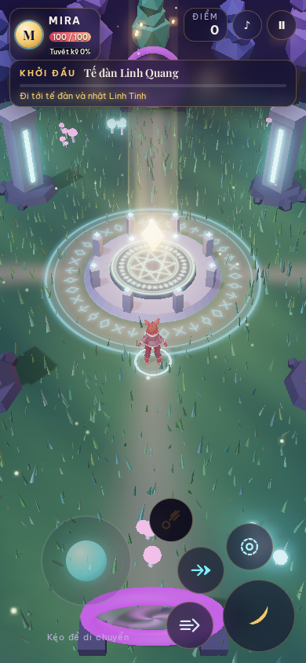

# Chương 4 — Xem game bằng mắt, thử game bằng tay

Khi AI báo “đã hoàn thành”, đó là lúc bạn bắt đầu duyệt. Game Mira có thể trông đẹp trong một ảnh nhưng vẫn sai khi nhân vật chạy, quái đánh hoặc màn hình thu nhỏ.

**Sau chương này, bạn làm được:** so asset với ảnh gốc, phân biệt ảnh đẹp với tính năng chạy thật, báo một lỗi đủ cụ thể để agent sửa.

## 4.1. Duyệt nhân vật ở hai nơi

Trước tiên, xem Mira trong Tripo Studio từ **trước và sau**. Ảnh chính diện cho thấy mắt, áo, dây túi và bốt. Ảnh phía sau cho thấy tóc, mũ áo và vị trí túi. Sau đó mới xem Mira trong game: dưới ánh sáng, camera và tỷ lệ mới, màu và hình có còn đúng không?

*Hình 4.1 — Ở Tripo, hãy kiểm ngoại hình của chính asset: mặt, tai, tay và bốt. Đây là bước kiểm hình khối, chưa kiểm cách nhân vật di chuyển trong game.*

*Hình 4.2 — Trong game, cùng asset chịu thêm ánh sáng, góc camera, chuyển động và hiệu ứng chém. Ngoại hình đúng trong Tripo chưa bảo đảm đọc rõ giữa lúc chiến đấu.*

## 4.2. Năm câu hỏi đủ dùng cho người mới

1. **Đúng người chưa?** Tóc, tai, áo và túi có còn giống ảnh nhân vật đã duyệt?
2. **Thấy rõ việc cần làm chưa?** Người mới có nhận ra tế đàn, Linh Tinh và quái không?
3. **Bấm có phản hồi chưa?** Đi, nhặt vật, ra chiêu có dấu hiệu nhìn hoặc nghe thấy?
4. **Có bất công không?** Đòn của quái có báo trước để người chơi tránh?
5. **Điện thoại có chơi được không?** Nút chạm có đủ lớn, không che mục tiêu?

*Hình 4.3 — Vòng đỏ trên đất là tín hiệu báo đòn của trùm. Khi duyệt, hãy thử xem người chơi có đủ thời gian và khoảng trống để tránh hay không.*

## 4.3. Ảnh chụp là bằng chứng của một khoảnh khắc

Ảnh trùm chứng minh game **có hình vòng cảnh báo**. Nó chưa chứng minh vòng cảnh báo xuất hiện đúng lúc hoặc phím lướt tránh được đòn. Muốn kiểm, hãy chơi: đứng gần trùm, chờ vòng đỏ, lướt khỏi vòng, thử lại hai lần. Video ngắn hoặc thao tác trực tiếp đáng tin hơn ảnh tĩnh cho chuyển động.

*Hình 4.4 — Bố cục điện thoại dọc: cần điều khiển ở trái, nút chiêu ở phải. Ảnh được chụp ở kích thước mobile trong trình duyệt; vẫn cần thử cảm giác chạm trên điện thoại thật.*

## 4.4. Gửi nhận xét sửa được

Nhận xét “game chưa mượt” quá rộng. Ví dụ giả định, nếu bạn gặp tình huống: “Trên điện thoại dọc, tôi chạm nút lướt khi vòng đỏ xuất hiện, nhưng Mira vẫn bị trúng”, hãy yêu cầu kiểm thời điểm miễn sát thương và phản hồi hình ảnh, đồng thời giữ nguyên tốc độ quái. Câu này có thiết bị, thao tác, hiện tượng và giới hạn sửa.

**Prompt dùng ngay:**

> Đây là ảnh hoặc video trạng thái game Mira. Hãy đối chiếu với mục tiêu tôi ghi bên dưới. Chỉ ra tối đa ba vấn đề có thể thấy hoặc tái hiện. Với mỗi vấn đề, nói cách thử để xác nhận trước khi sửa. Chưa thay mã cho đến khi đã phân biệt lỗi hình ảnh, lỗi điều khiển và lỗi luật chơi.

**Bài tập:** xem một ảnh desktop và một ảnh mobile. Viết một điều đã đạt, một điều chưa chắc, một phép thử cần làm. Đừng gọi “đạt” cho điều mà ảnh không chứng minh được.

## Trước khi sang chương 5

- [ ] Tôi kiểm asset ở Tripo và trong game ở hai bước riêng.
- [ ] Tôi thử thao tác, không chỉ nhìn ảnh.
- [ ] Tôi báo lỗi bằng thao tác và kết quả quan sát được.

Chương 5 biến nhận xét đó thành yêu cầu sửa ngắn, tiết kiệm lượt làm và token.
