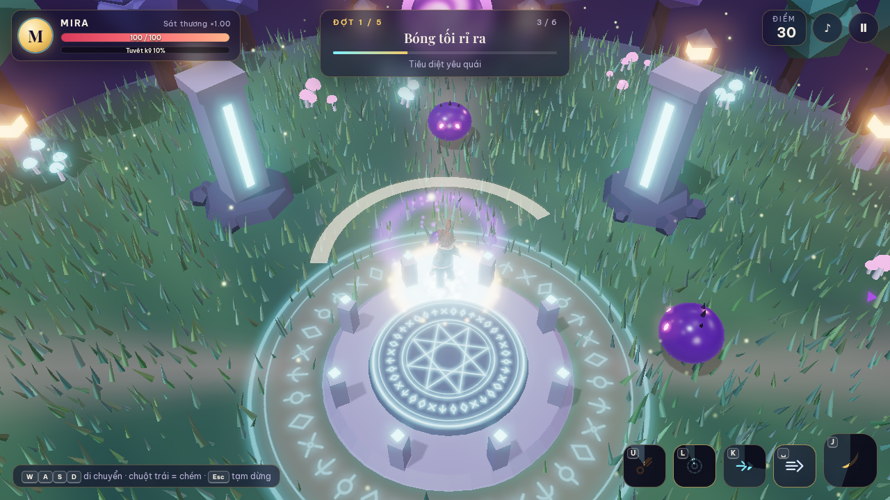
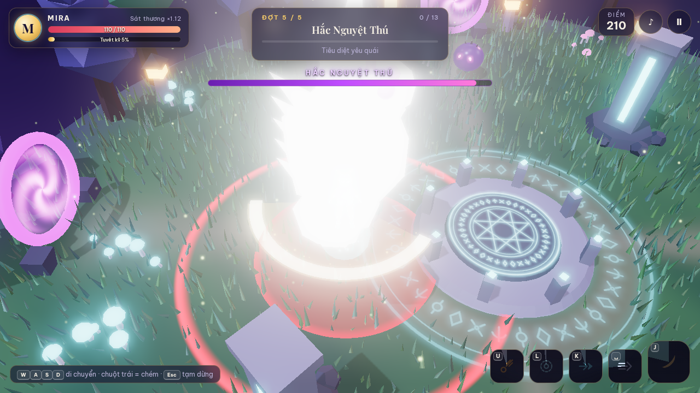

# Chương 5 — Sửa một lỗi của Mira mà không làm lại cả game

Ở Chương 4, bạn đã biết mô tả điều nhìn thấy. Bây giờ dùng mô tả đó để sửa đúng nơi. Mỗi vòng sửa nên có **một lỗi, một ảnh hoặc cách tái hiện, một kết quả cần thấy**.

**Sau chương này, bạn làm được:** phân biệt lỗi asset, lỗi hiển thị, lỗi điều khiển và lỗi luật chơi; gửi yêu cầu sửa ngắn mà vẫn đủ dữ kiện.

*Hình 5.1 — Hiệu ứng sáng có thể che nhân vật. Khi báo lỗi, hãy nêu đúng cảnh, đúng chiêu và điều bị che thay vì yêu cầu “chỉnh lại đồ họa”.*

## 5.1. Lỗi nằm ở đâu?

| Điều bạn thấy | Nơi kiểm trước | Việc nên giao |
|---|---|---|
| Bốt méo ở Tripo và trong game | Ảnh nhiều góc, GLB gốc | Sửa ảnh hoặc asset; chưa sửa ánh sáng game |
| Bốt đúng ở Tripo nhưng tối trong game | Đèn, vật liệu, camera | Chỉnh cảnh; giữ GLB |
| Mira đi nhưng chân không bước | Rig/clip trong GLB | Tạo asset có xương và hoạt ảnh |
| Chạm nút mà không ra chiêu | Input, hồi chiêu, trạng thái game | Tái hiện trên desktop/mobile rồi sửa |
| Quái chết quá nhanh | Luật sát thương/máu | Chỉnh cân bằng, không đổi model |

Một lỗi giày là ví dụ hay: nếu hình khối giày sai ở Tripo, đừng dùng hàng chục prompt Three.js để “che” nó. Ngược lại, nếu chỉ ánh sáng game làm giày mất chi tiết thì tạo lại GLB sẽ tốn credit không cần thiết.

## 5.2. Mẫu báo lỗi năm câu

**Hiện tại:** mô tả ngắn bản đang chạy. **Cách tái hiện:** bấm gì, ở màn nào. **Thực tế:** thấy gì. **Mong muốn:** muốn thấy gì. **Phải giữ:** phần đang đúng.

Ví dụ giả định dưới đây dùng để luyện cách báo lỗi; đây chưa phải lỗi đã xác nhận trong bản game Mira.

> Game Mira trên điện thoại dọc, đợt quái thứ hai. Tôi giữ nút Tia Linh Quang khi quái ở gần. Thực tế, tia sáng ra nhưng quái không mất máu. Mong muốn tia gây sát thương khi chạm đúng mục tiêu. Hãy kiểm va chạm và thời gian hồi chiêu, sửa đúng lỗi này; giữ nguyên ngoại hình Mira, tốc độ quái và các chiêu khác. Chạy thử trên localhost, cho tôi xem cách tái hiện trước và sau khi sửa.

**Cách thử:** lặp lại cùng thao tác ba lần; kiểm quái mất máu và các chiêu khác vẫn chạy. **Nếu chưa rõ:** yêu cầu agent chỉ ra log hoặc đoạn luật chơi nó đã kiểm, rồi mới tiếp tục sửa.

## 5.3. Giữ bản tốt làm điểm quay về

Trước khi đổi GLB, rig hay cả hệ chiêu, lưu một phiên bản đang chơi tốt. Bản game hiện có là mốc so sánh. Nếu hoạt ảnh chạy mới đẹp hơn nhưng nút chạm hỏng, chưa nên coi là nâng cấp hoàn thành.

Trong repo Mira, tên file đã tách theo việc: phần nhân vật ở player.js, quái ở enemies.js, chiêu ở skills.js, hiệu ứng ở fx.js, luật chơi ở logic.js. Người mới không cần sửa mã; chỉ cần nhờ agent nói **file nào liên quan** và vì sao. Nếu agent định sửa nhiều phần không liên quan, hãy dừng để kiểm phạm vi.

## 5.4. Token giảm khi thông tin đúng

Đừng dán toàn bộ lịch sử chat để hỏi một lỗi. Gửi **ảnh đúng khoảnh khắc**, **mô tả năm câu**, **tên dự án/file liên quan** và **điều đã thử**. Ngược lại, câu “fix game đi” thường dẫn tới nhiều vòng đoán hơn.

**Prompt dừng vòng lặp:**

> Chúng ta đã thử sửa lỗi này hai lần mà chưa đạt. Hãy ngừng sửa mã. Tóm tắt điều đã xác nhận, điều còn chưa biết và một phép kiểm tiếp theo có thể phân biệt các nguyên nhân. Đừng tạo lại asset hoặc đổi nhiều file trước khi có kết quả kiểm.

*Hình 5.2 — Một ảnh đúng thời điểm giúp agent hiểu lỗi liên quan đến cảnh báo, va chạm hay nút lướt; ảnh cũng giúp bạn so cùng tình huống sau khi sửa.*

## Trước khi sang chương 6

- [ ] Tôi phân loại lỗi trước khi nhờ sửa.
- [ ] Tôi có cách tái hiện và ảnh đúng khoảnh khắc.
- [ ] Tôi giữ bản game đang chạy tốt để so sau mỗi thay đổi.

Chương 6 tiếp tục với Mira: chuẩn bị nhân vật, quái và các asset trước khi tạo bản có xương và chuyển động.
