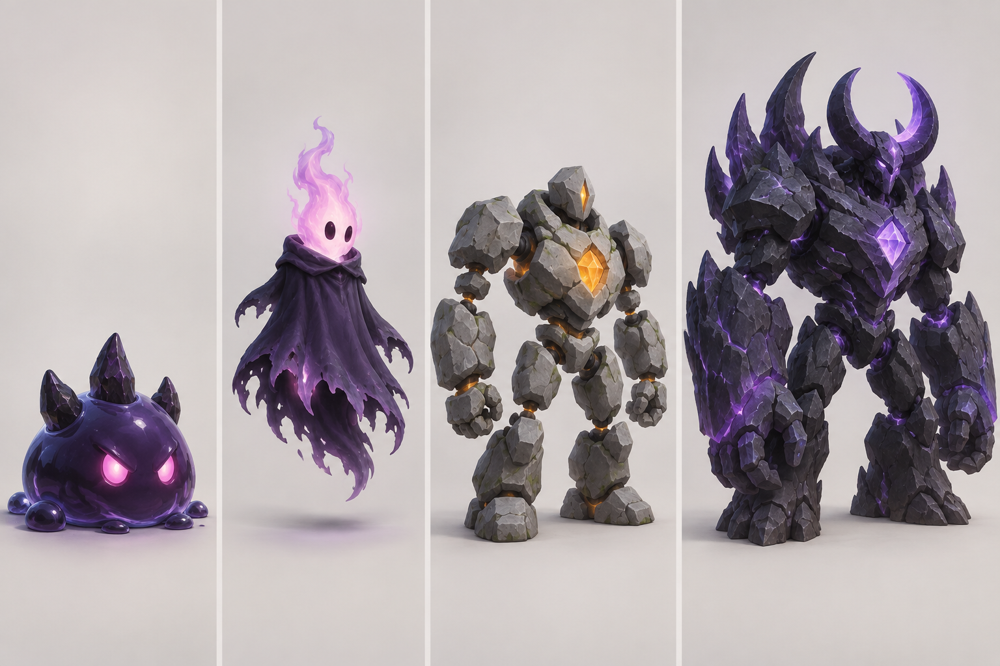
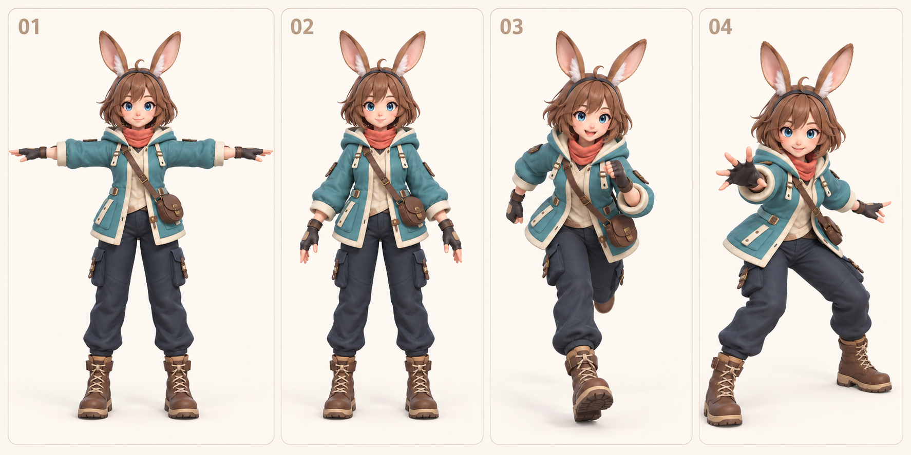

# Chương 6 — Chuẩn bị nhân vật và quái cho bản Mira tiếp theo

Game Mira đã chơi được. Việc tiếp theo là nâng chất lượng từng asset: Mira cần chuyển động tay chân, quái cần có hình dáng riêng. Trước khi gọi Tripo thêm lần nữa, hãy xác định thứ nào cần **mô hình 3D mới**, thứ nào chỉ cần chỉnh Three.js.

**Sau chương này, bạn làm được:** chuẩn bị ảnh tham chiếu, chọn cách tạo asset và nhận ra đâu là concept 2D, đâu là mô hình 3D thật.

## 6.1. Ba loại asset trong game hiện tại

| Trong game | Hiện được tạo thế nào? | Có cần Tripo ngay không? |
|---|---|---|
| Mira | GLB dựng từ ảnh nhiều góc trong Tripo | Không cần tạo lại để game chạy; cần bản có rig nếu muốn tay chân cử động |
| Slime, Ma Trơi, Thạch Quỷ, trùm | Hình khối và hiệu ứng bằng Three.js | Chưa cần; có thể đổi từng quái sau khi chốt thiết kế |
| Linh Tinh, cột sáng, cổng | Hình học và ánh sáng bằng Three.js | Không; hiệu ứng có thể chỉnh bằng mã |

*Hình 6.1 — Bộ concept 2D cho bốn cấp độ quái: slime, hồn lửa, người đá và trùm đá tím. Đây là hướng mỹ thuật để duyệt; game hiện tại chưa dùng bốn mô hình 3D từ ảnh này.*

## 6.2. Làm bộ ảnh nhân vật để phát triển chuyển động

Bốn ảnh trước/sau/trái/phải giúp Tripo dựng hình. Để chuẩn bị **animation**, cần thêm một ảnh nhân vật toàn thân ở dáng trung tính, tay tách khỏi thân và chân tách nhau. Dáng này giúp công cụ xác định tay, chân, vai, hông. Những ảnh chạy/chém dùng để duyệt phong cách động tác, **không thay cho file có xương**.

*Hình 6.2 — Bốn ảnh concept: dáng chữ T, dáng đứng nghỉ, chạy và ra chiêu. Ảnh chỉ mô tả ý định chuyển động; phần khớp và clip phải được tạo, xuất và kiểm trong file 3D riêng.*

**Prompt tạo ảnh tham chiếu bằng ChatGPT:**

> Dựa trên ảnh chính diện Mira đã duyệt, tạo một ảnh toàn thân tư thế chữ T để chuẩn bị gắn xương 3D. Giữ chính xác tóc, tai, áo khoác xanh ngọc, khăn san hô, túi, quần và hai chiếc bốt. Hai tay đưa ngang, bàn tay mở; hai chân tách nhẹ, đứng thẳng. Nền trắng, ánh sáng đều, không cắt tai hoặc giày. Không thay thiết kế nhân vật. Sau đó tạo thêm ba ảnh riêng để duyệt động tác: đứng nghỉ, chạy và ra chiêu.

**Cách thử:** đặt ảnh mới cạnh ảnh đã dùng dựng GLB. Nếu dáng chữ T có áo/túi/giày khác, nó là **concept sai nhận diện**; sửa ảnh trước. Nếu chỉ tư thế thay đổi còn nhận diện giữ nguyên, có thể dùng nó để nói rõ mục tiêu rig. **Nếu lỗi:** yêu cầu sửa đúng món đồ bị lệch, không tạo nhân vật mới.

## 6.3. Tripo Studio: dựng hình, Retopo, Rig và Animate

Ảnh preview H3.1 ban đầu có khoảng 502.944 tam giác và giữ ngoại hình tốt. GLB đời đầu đưa vào game có một mesh, không có rig hoặc clip. Bản repo hiện tại đã thay bằng GLB nhẹ hơn có 65 xương; mã game dùng những xương ấy để làm chân tay cử động. Vì thế, bước chuẩn bị asset quyết định phần nào Three.js có thể làm được.

Trong case Mira, Tripo đã yêu cầu **Retopo** trước khi Rig. Trình tự thực tế là: model đã duyệt → tạo lại lưới và kiểm ngoại hình → gắn xương, kiểm khớp → thử từng clip trong Animate → xuất GLB và kiểm file. Tripo khuyến nghị nhân vật hai chân ở tư thế chữ T hoặc A cho auto-rig; tư thế lạ, đồ rộng hoặc phần thân bị che có thể gắn xương chưa đúng. Chương 7 cho xem ảnh trước/sau Retopo, bộ xương và GIF chuyển động thật của Mira. [Tripo Help Center](https://www.tripo3d.ai/help/features/is-it-possible-to-upload-my-existing-model-for-animation), [Tripo Auto Rig](https://developers.tripo3d.ai/en/docs/animations-rig).

**Các điểm phải nhìn khi thử rig:** khớp gối nằm ở gối, không giữa bốt; khuỷu tay gập đúng chỗ; áo và túi không kéo méo vô lý; chân không xuyên đất khi chạy. Nếu model một khối quá dày hoặc nhiều chi tiết chồng, auto-rig có thể không đạt. Khi đó, chọn model phiên bản dễ gắn xương hơn hoặc xử lý asset ở công cụ chuyên 3D; không bảo AI “sửa bằng prompt” khi chưa xem mô hình.

## 6.4. Thiết kế quái theo thứ tự dễ đến khó

Trong ảnh concept, slime có một khối thân rõ; hồn lửa là vật bay; người đá có tay chân; trùm có nhiều mảnh và sừng. Đây là trình tự học tốt: thử thay **slime** trước. Nếu thay cả bốn quái cùng lúc, bạn khó biết lỗi do asset, chuyển động hay cân bằng game.

**Prompt nâng cấp một quái:**

> Trong game Mira, hãy giữ nguyên luật chơi của Slime Bóng Tối. Trước tiên phân tích hình khối hiện tại và ảnh concept tôi gửi. Đề xuất cách làm cho slime dễ nhận ra hơn từ camera game: giữ hình khối Three.js hay tạo GLB riêng. Chỉ chọn một cách, làm một bản thử, mở localhost để tôi so trước/sau. Chưa đụng tới Ma Trơi, Thạch Quỷ hoặc trùm.

**Cách thử:** nhìn slime ở kích thước nhỏ trong game, thử nó tiến lại và nhận đòn. **Nếu đẹp ở ảnh cận nhưng khó thấy trong game:** tăng độ tương phản hoặc đơn giản hóa hình, không vội tăng polycount.

## Trước khi sang chương 7

- [ ] Tôi phân biệt ảnh concept, mô hình GLB và bản có xương.
- [ ] Tôi có ảnh Mira ở dáng trung tính để diễn đạt mục tiêu rig.
- [ ] Tôi chọn một quái đầu tiên để nâng cấp, giữ nguyên luật chơi.

Chương 7 theo từng bước Retopo, Rig và Animate trên Mira, rồi chỉ cách kiểm GLB trước khi nối chuyển động vào game.
