# Chương 7 — Từ Retopo đến chuyển động của Mira

Phiên bản game đầu tiên dùng Mira không có xương: lúc chạy, cả mô hình nhún và nghiêng như một bức tượng. Tác giả sau đó làm Retopo, gắn xương và thử chuyển động trong Tripo. **Repo game mới nhất đã dùng một GLB có 65 xương** và có Xưởng chuyển động để xem từng động tác. Chương này đi theo đúng quá trình ấy, kể cả điều bất ngờ ở bước xuất file.

**Sau chương này, bạn làm được:** giao đúng việc cho Tripo và agent, kiểm tư thế chạy, phân biệt hoạt ảnh nhân vật với hiệu ứng phép và luật chơi.

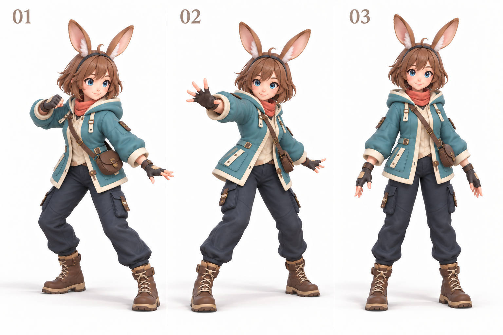

*Hình 7.1 — Ba ảnh phác thảo dáng chiến đấu, ra chiêu và đứng nghỉ. Chúng giúp duyệt ngôn ngữ cơ thể; đây chưa phải các clip có thể phát trong game.*

## 7.1. Rig khác Animate ở đâu?

Hãy hình dung con rối: **GLB ban đầu** giống tượng có màu; **rig** là bộ khớp ẩn trong tượng; **clip** là chuỗi tư thế theo thời gian. Three.js có thể phát clip nếu file chứa chúng; game Mira hiện dùng mã để điều khiển các xương vì file Tripo xuất ra chưa mang theo clip. [Three.js Animation System](https://threejs.org/manual/pages/animation-system.html).

Một nhân vật có thể chỉ có **một mesh** mà vẫn cử động được. File Mira đời đầu thiếu dữ liệu xương và liên kết da với xương; file mới đã có chúng. Bốn lớp cần phân biệt là:

| Thành phần | Hiểu đơn giản | Quan sát trên Mira |
|---|---|---|
| Mesh | Bề mặt có màu và hình khối | Mặt, tóc, áo, quần, bốt |
| Rig / skeleton | Bộ xương và các khớp | Vai, khuỷu, hông, gối, cổ chân xoay riêng |
| Skin weight | Mức độ mỗi vùng da đi theo khớp | Quần gập theo gối mà không gãy khúc |
| Clip animation | Chuỗi tư thế theo thời gian | Đứng thở, đi, chạy, tung chiêu |

Một **pose** là một tư thế ở một thời điểm. **Rig** tạo khớp và liên kết bề mặt với khớp; **Animate** tạo các pose nối tiếp thành clip. Có rig mà chưa có clip, Mira vẫn chưa tự đi. Có clip nhưng xuất file thiếu rig hoặc skin, game không thể gập chân tay đúng.

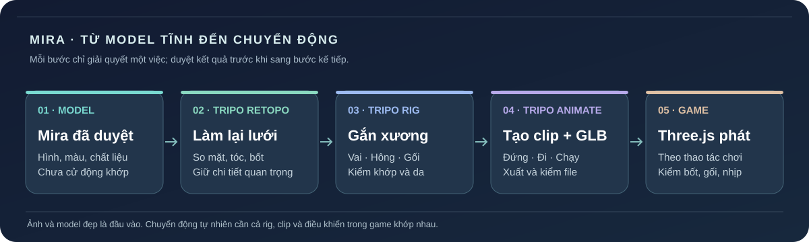

*Sơ đồ 7.1 — Từ model Mira qua Retopo, Rig, Animate đến file GLB và game. Mỗi bước có một kết quả cần kiểm trước khi đi tiếp.*

| Mong muốn | Cần thêm gì? | Ai làm phần nào? |
|---|---|---|
| Mira đứng thở nhẹ | Chuyển động idle trên xương | Bản game hiện tại dùng chuyển động do mã tạo; clip Tripo chỉ dùng nếu kiểm thấy có trong GLB |
| Mira đi và chạy | Chuyển động walk/run trên xương | Agent đồng bộ nhịp chân với quãng đường nhân vật đi |
| Mira chém bằng tay | Chuyển động attack trên thân trên | Agent cho động tác phát khi chiêu kích hoạt, kể cả lúc chạy |
| Mira nhảy qua vật cản | Chuyển động jump **và** luật nhảy/va chạm | Chuyển động tạo dáng; game quyết định độ cao, thời điểm tiếp đất |
| Tia sáng bắn ra | Không cần rig của Mira để vẽ tia | Three.js tạo hiệu ứng; luật chơi tính trúng đích |

**Điểm quan trọng:** dù chuyển động đến từ clip hay mã điều khiển xương, dáng nhảy chỉ là phần nhìn thấy. Nếu game chưa có cơ chế nhảy, va chạm và nút nhảy, nhân vật có thể làm động tác bật lên mà vẫn đứng một chỗ.

## 7.2. Quy trình nâng cấp đúng thứ tự

**Bước 1 — Giữ bản gốc.** Sao lưu GLB đời đầu và chụp cùng một góc Mira trong game. Bản gốc là điểm so nếu rig mới làm méo mặt, áo hoặc bốt.

**Bước 2 — Xử lý yêu cầu Retopo của Tripo.** Trong lần làm Mira này, Tripo yêu cầu **Retopology** trước khi gắn xương. Retopo là tạo lại lưới bề mặt để model nhẹ và các vùng khớp có cấu trúc phù hợp hơn. Đây là thao tác trên **model 3D**, chưa tạo xương hay chuyển động. Đừng suy ra mọi dự án đều cần chọn cùng một thông số; hãy nhìn mục tiêu và kiểm bản xem trước.

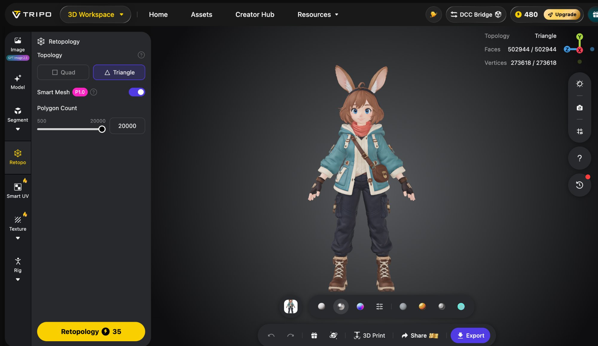

*Hình 7.2 — Tripo báo model gốc của Mira có 502.944 mặt tam giác. Ảnh chụp giao diện Retopo trước khi xử lý; lựa chọn Triangle trong ảnh không phải cấu hình cuối cùng đã dùng.*

Với nhân vật sẽ gập tay chân, tác giả đã chọn **Quad**, bật **Smart Mesh** và đặt **Polygon Count 20.000** theo giới hạn giao diện lúc đó. Quad giúp bố trí các vòng lưới quanh khớp dễ kiểm hơn, nhưng chất lượng gập vẫn phụ thuộc lưới và skin weight thực tế; không có nút nào bảo đảm tự động giữ nguyên mọi chi tiết. Con số 20.000 là **mức yêu cầu**, không phải số mặt của file kết quả. Sau khi xử lý, màn hình Rig ghi **10.756 mặt Quad**. So trước–sau ở mặt, mắt, tóc, tai, ngón tay, túi và bốt trước khi bấm Rig. Nếu chi tiết quan trọng bị mất, quay lại lịch sử và thử cấu hình khác.

**Bước 3 — Gắn xương trong Tripo.** Mở bản Mira sau Retopo, vào **Rig**, chọn **Humanoid** vì Mira có hai tay và hai chân. Giao diện gợi ý dáng **T hoặc A**: tay tách khỏi thân giúp vùng vai, nách và hông dễ nhận hơn. Danh sách **Skeleton Preset** là các định dạng bộ xương; ảnh kết quả của tác giả hiển thị preset Mixamo ngay **bên trong Tripo**. Người mới không cần chuyển sang phần mềm khác để làm theo case này. [Tripo Help Center](https://www.tripo3d.ai/help/features/is-it-possible-to-upload-my-existing-model-for-animation).

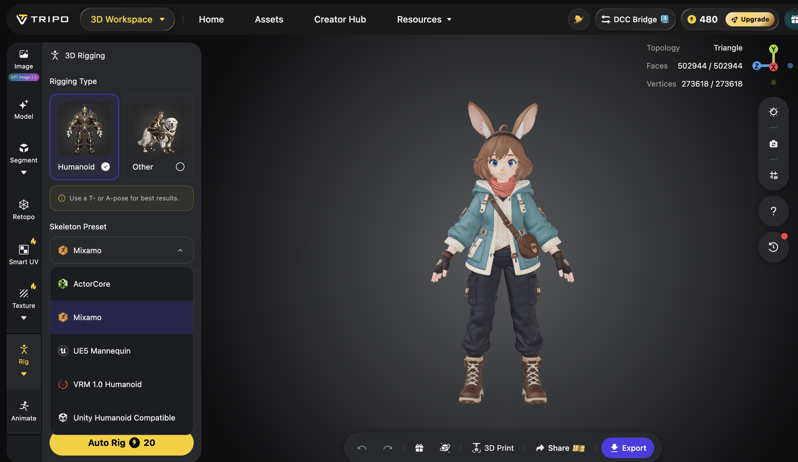

*Hình 7.3 — Tripo Studio ở bước chuẩn bị Auto Rig cho Mira: chọn Humanoid và xem các tùy chọn bộ xương. Ảnh này chưa phải kết quả.*

**Bước 3a — Kiểm kết quả rig trước khi tạo clip.** Ảnh kết quả cho thấy xương hông, cột sống, vai, tay, gối và chân đã hiện đúng vùng cơ thể; bàn tay cũng có các khớp ngón. Đây là **bằng chứng có xương**, chưa chứng minh clip hoạt ảnh đã tốt. Xoay Mira từ trước, bên và sau; kiểm gối, bốt, vạt áo và túi khi thử động tác. Tai thỏ chưa có xương riêng nên sẽ đi theo đầu; trong phiên bản nhập môn, điều đó chấp nhận được.

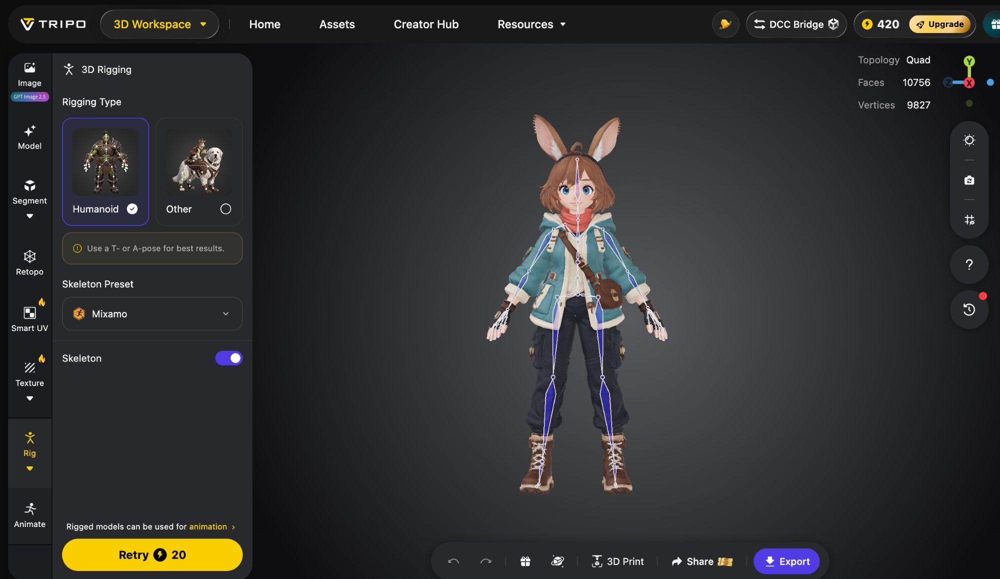

*Hình 7.4 — Kết quả thực tế sau Retopo và Auto Rig: Tripo hiển thị 10.756 mặt Quad cùng bộ xương của Mira. Cần thử chuyển động để biết phần da quanh khớp biến dạng ra sao.*

**Bước 4 — Tạo từng clip trong Tripo Animate.** Bắt đầu bằng **idle, walk, run**; thêm **stop** nếu tìm được chuyển động phù hợp. Chỉ thêm chiêu, nhảy, trúng đòn hoặc ngã sau khi đi và chạy đạt. Thử preset phù hợp trước, xem từng clip ở góc trước và bên. Nếu preset chưa đúng tính cách Mira, dùng ô **Create Your Own Animation** để mô tả một động tác ngắn mỗi lần. Một yêu cầu chứa cả đứng, chạy, nhảy và đánh sẽ khó kiểm lỗi.

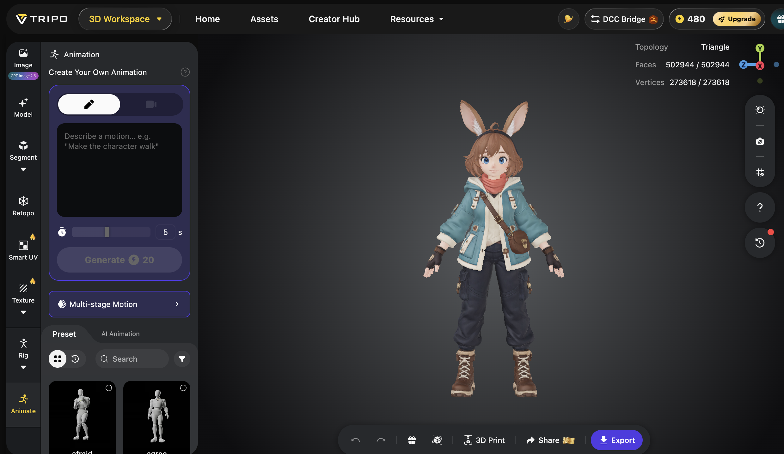

*Hình 7.5 — Khu vực Animate của Tripo có preset và ô mô tả chuyển động riêng. Đây là nơi chọn hoặc tạo clip sau khi rig đã đạt.*

**Mô tả mẫu để thử, mỗi lần một động tác:**

> **Đứng:** Nhân vật đứng yên, thở nhẹ, vai nhấc rất ít, đầu nhìn quanh chậm, hai bốt giữ trên mặt đất. Chuyển động lặp mượt, không bước đi.

> **Đi:** Nhân vật đi tại chỗ với bước ngắn tự nhiên, tay đối nhịp với chân, gót chạm rồi đến mũi chân, đầu ít rung. Vòng lặp không dịch chuyển nhân vật khỏi điểm bắt đầu.

> **Chạy:** Nhân vật chạy tại chỗ, hai chân luân phiên, tay đánh nhịp rõ hơn lúc đi, thân nghiêng nhẹ. Giữ vòng lặp đều, không làm tai, áo hoặc bốt biến dạng.

Nếu Tripo có lựa chọn **in-place / tại chỗ**, dùng cho game Mira vì mã game đã quyết định nhân vật đi đâu. Nếu không thấy tùy chọn này, xem preview và nhờ agent kiểm clip có kéo model tiến về phía trước không. Sau khi các clip đạt, xuất GLB có skeleton và animation; mở lại file để xác nhận dữ liệu thực sự có trong file. [Tripo Studio](https://www.tripo3d.ai/blog/tripo-studio-tutorial-english); [Tripo: preset và xuất nhân vật có hoạt ảnh](https://www.tripo3d.ai/blog/apply-preset-animations-to-3d-character).

**Ba clip tác giả đã xem thử trên chính Mira:**

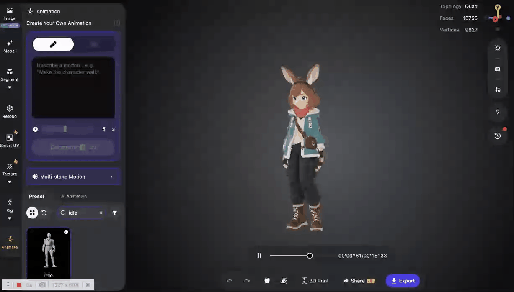

*Hình 7.6 — GIF preview clip idle: Mira đứng tại chỗ và cử động nhẹ. Khi duyệt, nhìn độ rung của đầu, tay và bốt; giữ chuyển động vừa đủ để dáng đứng không thành nhún nhảy.*

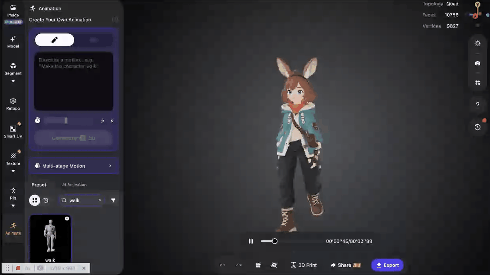

*Hình 7.7 — GIF preview clip walk: hai chân bước luân phiên. Cần kiểm ở cả góc bên và trong game để biết bốt có trượt trên nền khi gắn tốc độ di chuyển thật hay không.*

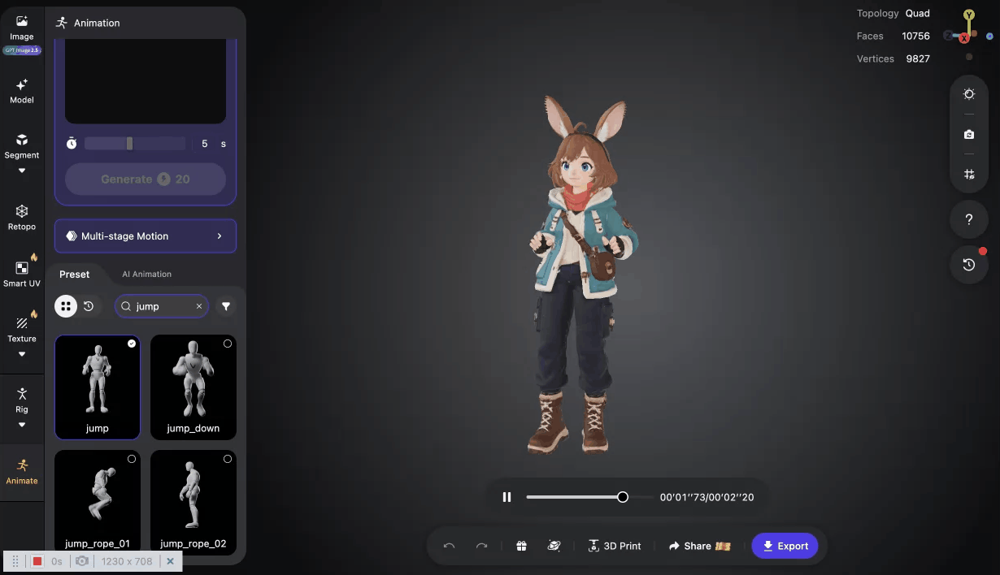

*Hình 7.8 — GIF preview clip jump: Mira bật lên và trở về dáng đứng. Clip diễn tả tư thế; luật nhảy, va chạm và thời điểm tiếp đất vẫn do game quyết định.*

Sau khi duyệt **idle** và **walk**, tìm preset **run** vừa phải, không cần kiểu chạy nước rút. **Stop** là clip tùy chọn: nếu không có preset phù hợp, game có thể chuyển mượt từ walk/run về idle trước. Chỉ tạo stop riêng khi cảnh dừng còn giật và bạn đã xác định rõ lỗi. Sau đó mới thử slash/cast/jump theo nhu cầu game; mỗi lần thêm một clip và kiểm trong game. Tên clip, số credit và cách gộp clip có thể thay đổi theo giao diện, nên xem danh sách clip trong file xuất ra. Nếu Tripo xuất từng clip thành từng GLB, đặt tên dễ hiểu như `mira_idle.glb`, `mira_walk.glb`, `mira_run.glb` và gửi đủ cho agent; nếu xuất được chung, dùng một file `mira_rigged.glb`.

**Bước 5 — Kiểm file xuất ra, rồi mới nối vào game.** Agent đã đọc file Tripo và phát hiện: **có xương, có liên kết da, nhưng không có clip hoạt ảnh**. Một số GLB được đặt tên theo động tác còn thiếu cả skin. Vì vậy ba GIF ở trên là preview trong Tripo, không phải bằng chứng các động tác đã nằm trong GLB. Repo game hiện dùng `public/mira-rigged.glb` làm nhân vật chính; `public/mira.glb` không xương là bản dự phòng.

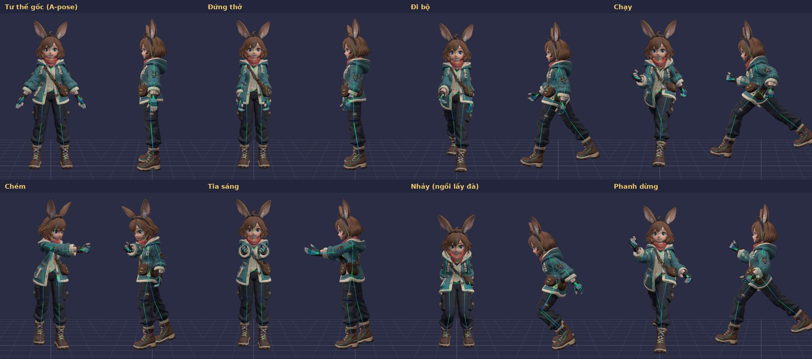

*Hình 7.9 — Tư liệu từ repo game mới nhất: mỗi động tác được so ở góc trước và góc nghiêng, kèm đường xương. Đây là chuyển động đã được dựng trên bộ xương trong game, khác với GIF preview trên Tripo.*

**Bước 6 — Tạo chuyển động trên bộ xương đã có.** Trong repo, mã chuyển động điều khiển 65 xương để Mira đứng thở, đi, chạy, dừng, chém, bắn, nhảy, lướt, trúng đòn và ngã. Nhịp chân được gắn với quãng đường Mira thực sự đi để giảm trượt bốt; khi ngừng chạy có động tác phanh. Người mới không cần viết các góc xương bằng tay: hãy giao agent mở Xưởng chuyển động và sửa đúng động tác chưa đạt. Nếu một lần xuất Tripo sau này có clip dùng được, agent có thể kiểm và thay từng động tác, không phải làm lại cả game.

**Prompt cho agent sau khi xuất GLB:**

> Tôi gửi GLB mới của Mira từ Tripo. Trước khi thay vào game, hãy báo riêng: (1) có bộ xương và skin không, (2) có bao nhiêu clip thực sự nằm trong file, tên và thời lượng từng clip, (3) kích thước file. Giữ GLB cũ làm dự phòng. Nếu không có clip, dùng bộ xương để tạo bản thử đứng, đi và chạy trong game; mở Xưởng chuyển động cho tôi xem trước, bên và góc chơi. Đồng bộ bước chân với tốc độ di chuyển, giữ nguyên quái và luật chơi.

**Cách thử:** đứng 3 giây, chạy thẳng, đổi hướng, dừng, chém. Nếu chân trượt, hỏi agent so **tốc độ di chuyển trong game**, **tốc độ phát clip** và **chuyển động có sẵn trong clip**. Nếu Mira chạy ra khỏi vị trí điều khiển, kiểm clip có dịch chuyển toàn thân hay không trước khi thêm mã bù. **Nếu rig méo ở đầu gối hoặc áo:** quay về Tripo/asset; đổi mã Three.js thường không sửa được trọng lượng khớp sai.

**Nếu xuất xong nhưng game vẫn chỉ nhún cả người:** yêu cầu agent báo file GLB mới có `skin` và `animation` hay không; đừng suy ra từ nút Export. **Nếu bốt lún đất:** kiểm vị trí gốc nhân vật, độ cao đặt model và khung hình chân chạm đất. **Nếu vai hoặc túi méo:** kiểm preview của rig ở Tripo trước; lỗi nằm ở liên kết da, không phải ở tốc độ chạy của game.

## 7.3. Từ dáng đẹp đến tư thế chơi đẹp

Một ảnh tư thế “ngầu” chưa chắc đọc được trong camera game nhìn từ trên. Hãy thử trên nền thật, ở kích thước Mira xuất hiện khi chơi. Khi chạy, thân nghiêng nhẹ theo hướng; hai tay và hai chân đổi nhịp; bốt chạm đất rõ. Khi chém, người chơi phải nhận ra ba nhịp **chuẩn bị → ra đòn → hồi về**. Nếu ra chiêu quá nhanh hoặc ánh sáng che tay, giảm hiệu ứng hoặc kéo rõ nhịp động tác trước khi thêm chi tiết.

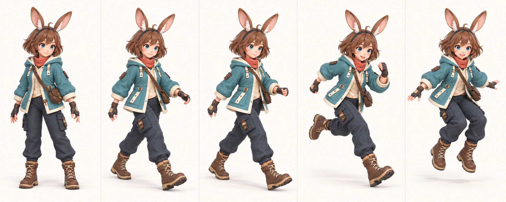

*Hình 7.10 — Bộ concept 2D để duyệt lần lượt: đứng, hai pha bước, chạy và bật nhảy. Năm ảnh chưa phải clip hoạt ảnh của GLB. Hãy dùng chúng làm tiêu chí kiểm nhịp tay–chân, hướng thân và hình dáng hai chiếc bốt sau khi gắn xương.*

**Bài tập ngắn:** chọn hai ảnh bước đi ở giữa, chỉ ra chân nào đang đưa lên và chân nào đang chịu lực. Sau khi có bản rig, xem clip ở tốc độ chậm và so đúng hai khoảnh khắc ấy. Nếu cả hai bốt cùng lướt trên đất, cần sửa clip hoặc tốc độ phát trước khi thêm hiệu ứng chạy.

*Hình 7.11 — Ảnh chiến đấu cho thấy vệt chém và phản hồi trúng đòn. Bảng tư thế Hình 7.9 cho thấy động tác chém đã được dựng trên bộ xương ở bản game mới.*

## 7.4. Phép thuật có ba lớp dễ kiểm

Lấy **Tia Linh Quang** làm ví dụ. Lớp 1 là **luật**: chiêu bắn khi nào, trúng ai, gây bao nhiêu sát thương. Lớp 2 là **tư thế**: Mira hướng tay về mục tiêu, nếu đã có clip phù hợp. Lớp 3 là **hiệu ứng**: tia sáng, hạt, âm thanh, rung nhẹ và số sát thương. Chỉ làm lớp 3 sẽ đẹp mắt nhưng dễ sai cảm giác trúng đích; chỉ làm lớp 1 thì khó biết mình đã đánh trúng.

*Hình 7.12 — Ánh sáng lan quanh Mira là hiệu ứng của chiêu Vòng Tinh Tú. Khi nâng cấp, kiểm vòng sáng có trùng thời điểm gây sát thương và có che nhân vật, quái hoặc vòng cảnh báo không.*

**Prompt nâng cấp một chiêu:**

> Hãy nâng cấp riêng chiêu Tia Linh Quang trong game Mira. Trước tiên mô tả ba lớp hiện tại: luật trúng đích, tư thế nhân vật và hiệu ứng hình/âm. Giữ nguyên sát thương và hồi chiêu. Nếu GLB mới có clip phù hợp, phát clip khi bắn; nếu không, nói rõ và giữ tư thế hiện có. Làm tia dễ nhìn nhưng không che quái hay cảnh báo nguy hiểm. Mở localhost, thử một mục tiêu đứng gần và một mục tiêu di chuyển.

**Cách thử:** nhìn thời điểm bấm, thời điểm tia chạm, thanh máu quái và lúc chiêu hồi. Nếu hiệu ứng đẹp mà máu không giảm, sửa luật/va chạm; nếu máu giảm trước khi tia chạm, đồng bộ thời điểm.

## Trước khi sang chương 8

- [ ] Tôi phân biệt file Mira đời đầu không xương với file mới có 65 xương nhưng không có clip xuất từ Tripo.
- [ ] Tôi phân biệt được mức Retopo đã chọn với số mặt Quad thực tế của bản kết quả.
- [ ] Tôi duyệt riêng động tác đứng, đi và chạy trước khi thêm động tác đánh.
- [ ] Tôi kiểm file GLB có rig, skin và bao nhiêu clip; nếu chưa có clip, tôi yêu cầu agent thử chuyển động trên bộ xương như repo Mira.
- [ ] Tôi thử chân, gối, tay và bốt ở góc camera chơi.
- [ ] Tôi tách luật, tư thế và hiệu ứng của một chiêu.

Chương 8 chỉ cách tiếp tục từ chính repo Mira đã chạy, thay vì bắt đầu dự án mới mỗi lần muốn nâng cấp.
