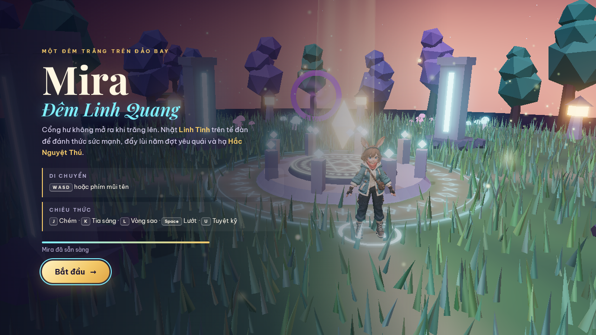
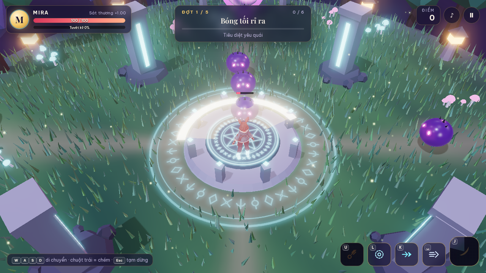

# Chương 8 — Mở rộng repo Mira thay vì làm game mới

Mira đã có một repo chạy được. Mỗi ý tưởng tiếp theo nên bắt đầu từ bản đó: xem hiện trạng, chọn một phần, sửa và chơi lại. Đây là cách người mới làm chủ dự án mà không cần tự viết mã.

**Sau chương này, bạn làm được:** giao agent đọc đúng repo, chọn phạm vi sửa và giữ bản cũ làm điểm quay về.

*Hình 8.1 — Đây là màn mở đầu của bản Mira hiện tại. Khi thêm hoạt ảnh, quái hoặc phép, màn này và lối vào game phải tiếp tục hoạt động.*

## 8.1. Đọc repo như đọc sơ đồ căn nhà

| Bạn muốn thay | Nơi agent cần kiểm trong repo Mira |
|---|---|
| Mira hiện và chuyển động | `player.js`, `mira-rigged.glb`, thư mục `src/anim/` |
| Quái và trùm | enemies.js, logic.js |
| Tia sáng, vệt chém, hạt | skills.js, fx.js |
| Đảo bay, cổng, cây cỏ | world.js |
| Nút chạm và bàn phím | input.js, style.css |
| Tiếng bước, chiêu và nhạc nền | audio.js, thư mục public/audio |
| Xem từng chuyển động ở nhiều góc | studio.js, thư mục src/anim |
| Luồng màn chơi, camera, HUD | main.js |

Bạn không cần nhớ các tên file. Bảng này giúp nhận ra khi một yêu cầu nhỏ lại khiến agent sửa gần cả repo. Nếu muốn đổi màu tia sáng mà agent định làm lại cơ chế quái, hãy yêu cầu giải thích trước.

## 8.2. Một hành động trong game đi qua những phần nào?

Lấy việc **nhặt Linh Tinh** làm ví dụ. Người chơi đưa Mira tới tế đàn bằng bàn phím hoặc cần ảo. Game kiểm khoảng cách; khi đủ gần, vật trên tế đàn biến mất, phát tiếng nhặt, hiện cột sáng và mở đợt quái tiếp theo. Từ góc nhìn người chơi, đó là **một khoảnh khắc**. Trong repo, nhiều bộ phận phối hợp để tạo ra khoảnh khắc ấy.

*Hình 8.2 — Ảnh thật từ repo game: Mira tới tế đàn và nhặt Linh Tinh. Hãy quan sát vật biến mất, hiệu ứng sáng, âm thanh và mục tiêu mới như một chuỗi phản hồi, không phải bốn tính năng rời.*

| Điều người chơi thấy | Phần chịu trách nhiệm trong repo |
|---|---|
| Mira tiến đến tế đàn | `input.js` nhận thao tác; `player.js` và `main.js` cập nhật vị trí |
| Nhặt khi đến đủ gần | `main.js` kiểm khoảng cách và gọi xử lý nhặt |
| Vật biến mất, ánh sáng xuất hiện | `world.js`, `fx.js` |
| Có tiếng nhặt và chữ báo | `audio.js`, giao diện trong `main.js` |
| Đợt quái tiếp theo bắt đầu | `logic.js`, `enemies.js`, `main.js` |

**Bài học:** khi báo lỗi, hãy nói **khâu nào trong chuỗi chưa xảy ra**. “Tôi chạm Linh Tinh, vật biến mất nhưng đợt quái không bắt đầu” giúp agent khoanh vùng nhanh hơn “game lỗi”.

## 8.3. Prompt giao việc trên repo có sẵn

> Đây là repo **Mira · Đêm Linh Quang**. Trước tiên đọc README, chạy bản hiện tại và liệt kê phần nào đang hoạt động. Tôi muốn nâng cấp **[một việc]**. Hãy chỉ ra file liên quan, ảnh hoặc asset đầu vào cần có và hai cách kiểm kết quả. Giữ nguyên phần chơi đã chạy. Làm xong, mở localhost để tôi chơi lại trên desktop và bố cục mobile; báo file đã sửa và lỗi còn lại.

**Cách thử:** chơi lại từ màn mở đầu đến nhặt Linh Tinh. Nếu nâng cấp quái, tiếp tục tới đúng đợt quái đó. **Nếu lỗi:** quay về bản trước rồi sửa trong phạm vi một việc.

## 8.4. Lấy một vòng nâng cấp làm mẫu

Giả sử bạn muốn thay Slime Bóng Tối bằng nhân vật trong ảnh concept. Đừng bắt đầu bằng “thay hết quái cho đẹp hơn”. Vòng đúng là: **duyệt concept → chọn cách dựng hình → đổi đúng slime → giữ cách di chuyển/tấn công → chơi thử → so trước/sau**. Nếu hình mới đẹp khi nhìn gần nhưng mờ trong camera game, chỉ sửa độ đọc của slime. Chưa cần động tới Ma Trơi, Thạch Quỷ hoặc trùm.

*Hình 8.3 — Ảnh bản gốc để so sau khi thay một quái. Phải giữ được khoảng cách chiến đấu, vệt đánh và phản hồi khi quái trúng đòn.*

## 8.5. Xưởng chuyển động giúp duyệt gì?

Repo có màn **Xem chuyển động** ngay ở menu đầu. Tại đây, người đọc có thể chọn đứng, đi, chạy, dừng hoặc ra chiêu; đổi góc camera, chỉnh tốc độ và bật đường xương. Đây là nơi tốt để kiểm **dáng nhân vật**, trước khi kiểm **luật chơi** trong màn chiến đấu. Bản này dùng chuyển động được dựng bằng mã trên bộ xương của Mira, vì GLB xuất từ Tripo không chứa các clip keyframe đã xem trong preview.

*Hình 8.4 — Xưởng chuyển động trong repo thật: bật hiển thị xương để thấy tay, hông, gối và bàn chân khi đổi tư thế. Xưởng giúp kiểm động tác riêng; sau đó vẫn phải chơi game để kiểm va chạm và tốc độ di chuyển.*

## Trước khi sang chương 9

- [ ] Tôi mở được bản gốc trước khi sửa.
- [ ] Tôi biết một yêu cầu gắn với nhóm file nào.
- [ ] Tôi thử lại vòng chơi sau khi đổi asset hoặc luật.

Chương 9 giúp chọn lúc nào làm thủ công trong Studio, lúc nào để agent gọi công cụ ngoài.
