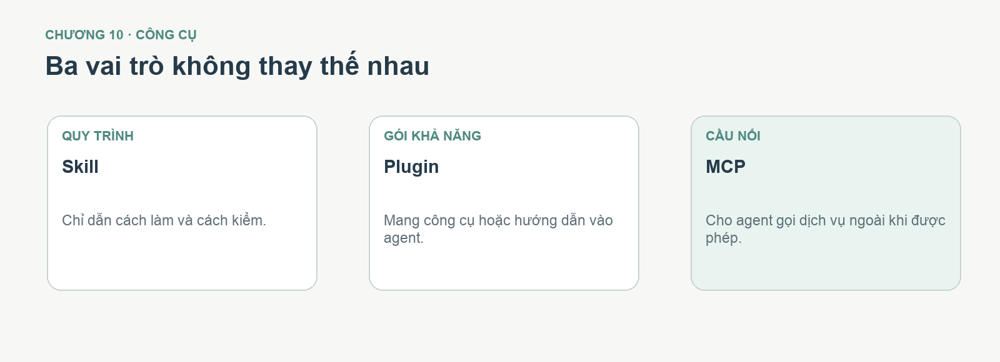

# Chương 9 — Dùng công cụ đúng lúc trong dự án Mira

Game Mira cho thấy không phải việc gì cũng cần thêm plugin hoặc MCP. Bộ ảnh được duyệt bằng mắt, model được xem trong Tripo Studio, rồi file GLB được đưa cho agent làm game. Repo game còn có **Xưởng chuyển động** riêng để kiểm xương và dáng đi sau khi nhập GLB. Hai nơi xem thử này có mục đích khác nhau: Tripo chuẩn bị asset, Xưởng của game kiểm asset hoạt động trong mã. Chương này giúp bạn chọn công cụ theo **việc đang mắc**, không theo danh sách công cụ có thể cài.

**Sau chương này, bạn làm được:** phân biệt ba lớp hỗ trợ, quyết định lúc dùng Studio và lúc tự động hóa.

*Hình 9.1 — Skill hướng dẫn cách làm; plugin có thể đóng gói kỹ năng/công cụ; MCP nối agent với dịch vụ ngoài. Người dùng vẫn cần duyệt ảnh và kết quả 3D.*

## 9.1. Ba từ cần nhớ

| Tên | Hiểu bằng một câu | Ví dụ Mira |
|---|---|---|
| **Skill** | Bộ hướng dẫn để agent làm theo một quy trình | Brainstorm trước khi thay cả hệ chiến đấu |
| **Plugin** | Gói mở rộng chức năng | Gói có công cụ làm việc với Tripo |
| **MCP** | Cầu nối để agent gọi một công cụ ngoài | Agent gửi ảnh tới dịch vụ tạo 3D |

Ba thứ này **không thay thế ảnh tham chiếu tốt**. Một MCP nạp nhầm góc ảnh vẫn có thể cho model sai. Vì thế ở case Mira, việc chuẩn bị bốn góc và tự xoay preview trong Tripo là một phần của chất lượng, không phải thao tác thừa.

## 9.2. Chọn Studio hay tự động hóa?

Khi thử **một nhân vật**, hãy ưu tiên cách bạn nhìn và kiểm được: nạp ảnh vào Tripo Studio, xem trước/sau/trái/phải, kiểm bốt, rồi xuất GLB. Khi cần tạo **nhiều asset giống quy trình nhau**, MCP/API có thể tiết kiệm thao tác, nhưng phải có tiêu chí tự động dừng khi đầu vào hoặc preview chưa đạt.

| Nếu bạn đang… | Cách hợp lý |
|---|---|
| Chọn bản Mira đẹp nhất, kiểm bốt và tóc | Tripo Studio, duyệt thủ công |
| Tạo nhiều biến thể slime theo cùng quy tắc | Cân nhắc MCP/API sau khi chốt mẫu |
| Tìm vì sao chân không gập | Kiểm GLB và rig, không gọi tạo ảnh mới |
| Lên kế hoạch đổi toàn bộ hệ quái | Brainstorm, chọn một quái làm mẫu trước |

## 9.3. Prompt cho việc có thể tốn credit

> Tôi muốn tạo một quái mới cho game Mira bằng Tripo. Trước khi dùng lượt tạo trả phí, hãy đề xuất ảnh tham chiếu, số góc cần có và dáng phù hợp với camera game. Báo chi phí hiển thị ở thời điểm thao tác, định dạng GLB cần xuất và cách kiểm mặt, tay, chân khi xem trong game. Làm một bản thử, mở preview cho tôi xem rồi dừng; không tự lặp thêm lượt tạo khi chưa có nhận xét.

**Cách thử:** prompt phải tạo ra kế hoạch và tiêu chí kiểm trước khi tiêu credit. **Nếu agent chỉ nói “tôi sẽ làm đẹp hơn”:** yêu cầu nêu rõ chi tiết nào cần sửa và ảnh nào dùng để đối chiếu.

## Trước khi sang chương 10

- [ ] Tôi chọn công cụ theo việc cần làm, không cài mọi thứ trước.
- [ ] Tôi duyệt đầu vào và preview dù thao tác bằng MCP.
- [ ] Tôi biết chi phí và điểm dừng trước một lần tạo asset.

Chương 10 chọn một lộ trình nâng cấp từ bản Mira đang chơi được đến phiên bản có hành động và hình ảnh nhất quán hơn.
