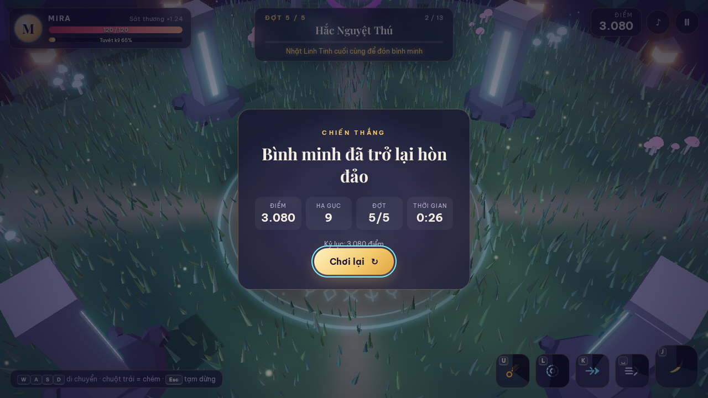
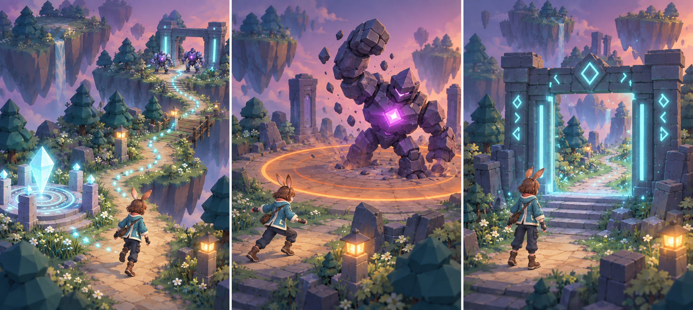

# Chương 10 — Kế hoạch nâng cấp và chia sẻ game Mira

Bạn đã có một game thực sự chơi được và một nhân vật đã cử động bằng xương. Đây là **chương cuối của dự án Mira**. Ta nhìn lại vòng chơi đã có, chọn một cải tiến nhỏ và kiểm cả desktop lẫn điện thoại trước khi chuyển sang dự án khác.

**Sau chương này, bạn làm được:** chọn thứ tự nâng cấp, biến một ý tưởng truyện thành tính năng nhỏ có thể thử, kiểm từng mốc và nói trung thực điều đã có, điều mới là concept.

*Hình 10.1 — Màn chiến thắng của game Mira. Đây là mốc kiểm cuối: mỗi lần nâng cấp quái, chiêu hoặc bối cảnh phải giữ được vòng chơi tới điểm kết thúc.*

## 10.1. Năm mốc cho phiên bản kế tiếp

| Mốc | Việc làm | Đầu ra cần duyệt |
|---|---|---|
| 1. Nhân vật | Rig và bộ chuyển động đã có; tiếp tục sửa dáng chưa đạt | Xem Xưởng chuyển động ở nhiều góc, thử bốt trong game |
| 2. Quái đầu tiên | Nâng cấp Slime Bóng Tối | Hình mới đọc rõ, luật cũ vẫn đúng |
| 3. Một chiêu | Đồng bộ tư thế, tia sáng và sát thương | Bấm → thấy ra chiêu → quái phản hồi đúng |
| 4. Bối cảnh | Chỉnh đường đi và ánh sáng nơi dễ lạc | Người mới tìm được tế đàn, quái và cổng |
| 5. Mobile | Thử máy thật, giảm phần làm chậm | Đi/chém/né được bằng ngón tay, hình đủ rõ |

**Không cần làm cả năm mốc trong một prompt.** Chọn một mốc đang cần nhất, duyệt xong mới sang mốc khác. Mỗi mốc có một ảnh hoặc video “trước”, một bản chạy “sau” và hai câu nhận xét.

## 10.2. Ba ý tưởng phát triển từ cùng một câu chuyện

Ở Chương 3, ta phác thảo tuyến truyện từ Linh Tinh đến cổng trùm. Muốn người chơi **cảm thấy** câu chuyện đó, không nhất thiết thêm đoạn văn dài. Có thể thay bằng ba tín hiệu trong lúc chơi. Mỗi tín hiệu giải quyết một việc cụ thể:

*Hình 10.2 — Ba concept cho phiên bản sau: dấu sáng dẫn tới mục tiêu, vòng cảnh báo đòn trùm dễ đọc hơn và cổng sáng lên sau chiến thắng. Đây không phải ba tính năng đã hoàn tất. Bản game hiện có cảnh báo đòn trùm; ảnh giữa gợi cách làm tín hiệu ấy rõ hơn.*

| Gợi ý | Người chơi hiểu thêm điều gì? | Bản thử nhỏ nhất |
|---|---|---|
| Dấu sáng dẫn đường | Sau khi nhặt Linh Tinh, cần đi về phía cổng | Chỉ hiện một dải sáng ngắn khi người chơi chưa tìm được đường |
| Cảnh báo trùm rõ hơn | Đòn mạnh sắp rơi ở đâu và còn thời gian để né | So vòng cảnh báo cũ/mới ở cùng camera, giữ sát thương cũ |
| Cổng đổi trạng thái | Chiến thắng đã mở đường tiếp | Sau khi trùm bị hạ, rune trên cổng sáng và hiện lối đi; chưa cần màn mới |

**Prompt cho một nhánh, không làm cả ba:**

> Game Mira hiện đã có tế đàn, các đợt quái và trùm. Hãy nâng cấp **riêng tín hiệu dẫn đường sau khi nhặt Linh Tinh**: đề xuất một dấu sáng ngắn trên đường đi, không biến cả màn thành đường kẻ phát quang. Trước khi sửa, cho tôi xem ảnh trạng thái hiện tại và vị trí dự kiến. Giữ nguyên quái, chiêu, sát thương và hiệu năng mobile. Làm một bản thử, mở localhost, thử với người chưa biết bản đồ và ghi xem họ tìm được hướng đi hay không.

**Cách thử:** cho một người mới chơi từ lúc nhặt vật. Nếu họ vẫn không biết hướng đi, kiểm vị trí và thời điểm xuất hiện của dấu sáng. Nếu người chơi đã biết đường mà vẫn bị hiệu ứng bám theo liên tục, giảm hoặc tắt nó sau khi đã học được đường.

## 10.3. Khi nào thêm bối cảnh và hiệu ứng?

Bối cảnh hiện có đảo bay, cỏ, cổng và tế đàn. Nếu người chơi không biết đi đâu, việc đầu tiên là **làm rõ đường và mục tiêu**, không thêm nhiều cây. Nếu quái bị chìm vào nền, chỉnh tương phản hoặc kích thước trước khi tăng độ phức tạp model. Nếu phép làm màn hình trắng, giảm ánh sáng ở đúng khoảnh khắc.

*Hình 10.3 — Hiệu ứng Vòng Tinh Tú làm cảnh sáng mạnh. Khi duyệt, kiểm Mira, quái và tín hiệu nguy hiểm có còn nhìn được trong lúc phép xuất hiện.*

**Prompt nâng bối cảnh theo mục tiêu chơi:**

> Tôi muốn người mới dễ nhận ra tế đàn và đường đi trong game Mira. Hãy mở bản đang chạy, chụp một ảnh lúc bắt đầu và một ảnh lúc có quái. Chỉ đề xuất tối đa ba thay đổi về ánh sáng, màu hoặc vị trí đạo cụ để hướng mắt người chơi. Giữ lối chơi và hiệu năng mobile. Làm một bản thử, cho tôi so ảnh trước/sau cùng góc camera.

**Cách thử:** nhờ một người chưa chơi tìm Linh Tinh mà không được chỉ tay. **Nếu họ vẫn lạc:** sửa tín hiệu dẫn đường, không thêm lời giải thích dài lên màn hình.

## 10.4. Đưa dự án cho người khác xem

Trước khi chia sẻ, thử toàn bộ vòng chơi: mở màn → di chuyển → nhặt Linh Tinh → gặp các loại quái → đánh trùm → thắng hoặc thua → chơi lại. Trên desktop, thử bàn phím và chuột. Trên điện thoại thật, thử cần ảo và nút chiêu. Ảnh chụp mobile trong sách cho thấy bố cục ở kích thước nhỏ; nó chưa chứng minh tốc độ trên mọi điện thoại.

*Hình 10.4 — Ảnh điện thoại từ repo mới nhất: cần ảo và các nút chiêu được đặt quanh vùng chơi. Ảnh kiểm bố cục; cần thử trên máy thật để đánh giá thao tác chạm và tốc độ.*

Khi giới thiệu dự án, ghi rõ: **game hiện chạy được, Mira đã có 65 xương và chuyển động dựng bằng mã trên bộ xương**. Những GIF ở Tripo là preview; GLB xuất ra chưa chứa clip hoạt ảnh tương ứng. Ảnh concept quái và các tính năng tương lai vẫn là định hướng, chưa phải asset đang chơi. Cách nói đó giúp người đọc thấy đúng quá trình phát triển.

*Hình 10.5 — Trận trùm trong repo thật. Đây là tình huống kiểm cuối cho cảnh báo đòn đánh, hiệu ứng, điều khiển và khả năng quan sát nhân vật khi màn hình nhiều chi tiết.*

**Prompt kiểm cuối:**

> Hãy chạy bản game Mira hiện tại và kiểm vòng chơi từ màn mở đầu tới thắng hoặc thua. Ghi rõ phần đã thử trên desktop, phần đã thử ở bố cục mobile trong trình duyệt và phần chỉ có thể xác nhận bằng điện thoại thật. Chụp ảnh ba mốc: bắt đầu, chiến đấu, kết thúc. Báo lỗi chặn việc chơi và sửa đúng lỗi đó; chưa mở thêm tính năng mới.

## 10.5. Xem bản game Mira đã hoàn thành

Video dưới đây cho thấy kết quả của case Mira sau nhiều vòng sửa asset, chuyển động và luật chơi. Hãy xem để nhận ra **nhân vật, bối cảnh, quái, chiêu và mục tiêu** đã kết hợp thành một màn chơi như thế nào; video là bản trình diễn, không thay cho việc tự chơi thử trên thiết bị của bạn.

[Video 10.1 — Game 3D Mira, bản trình diễn hoàn thành](https://youtu.be/zylONoqmndQ)

## Kết thúc case Mira

- [ ] Tôi có bản game đang chơi được và biết mở trên localhost.
- [ ] Tôi phân biệt ảnh concept, preview Tripo và ảnh game thật.
- [ ] Tôi biết dùng Xưởng chuyển động để kiểm Mira đứng, đi, chạy và ra chiêu bằng khớp.
- [ ] Tôi có thứ tự nâng cấp nhân vật, quái, phép, bối cảnh và mobile.
- [ ] Tôi kiểm lại vòng chơi sau mỗi lần sửa.

Một prompt có thể tạo bản đầu rất nhanh. Khả năng làm chủ thể hiện ở các vòng tiếp theo: chọn đúng thành phần, đưa đúng asset, thử đúng tình huống và giữ phần đã đạt.

Chương 11 bắt đầu **một dự án mới**: landing page chủ đề vũ trụ. Ảnh và hệ thống game Mira dừng tại đây; mục tiêu của dự án kế tiếp là kể chuyện bằng hình chuyển động và dẫn người xem tới một hành động rõ ràng.
