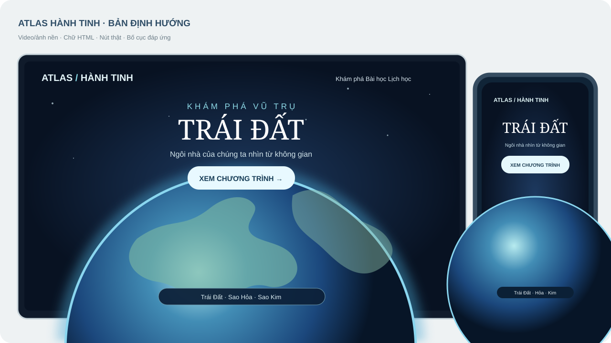
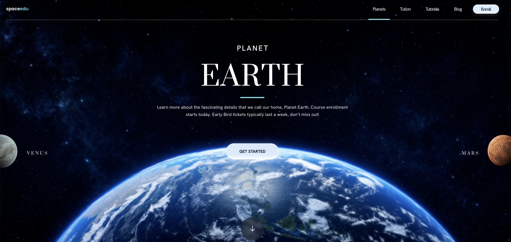
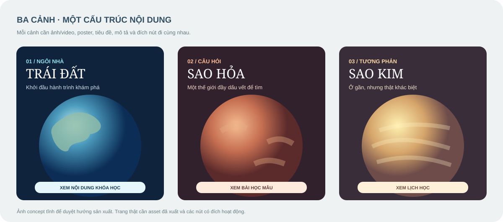
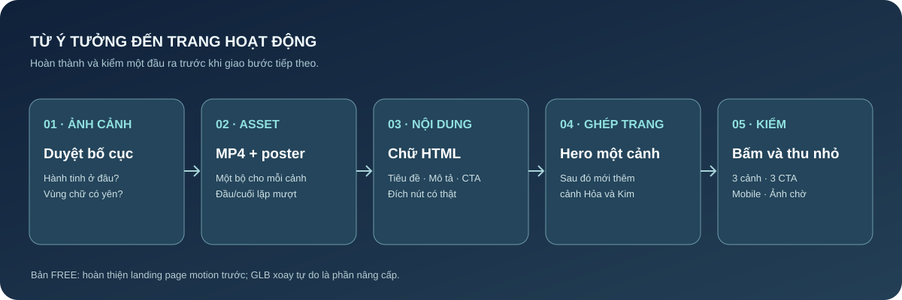

# Chương 11 — Dự án mới: landing page khám phá hành tinh

**Atlas Hành Tinh** là trang giới thiệu một chương trình học về vũ trụ. Người xem mở trang, chọn Trái Đất, Sao Hỏa hoặc Sao Kim, đọc vài dòng giới thiệu rồi bấm đăng ký. Đây là một dự án landing page độc lập, dùng hình ảnh chuyển động để kể chuyện.

**Sau chương này, bạn làm được:** chọn giữa video tạo cảm giác 3D và model GLB tương tác; chuẩn bị asset cho một hero; viết prompt đủ rõ; kiểm ba cảnh, CTA và điện thoại.

*Hình 11.1 — Mockup riêng của dự án Atlas Hành Tinh: hình hành tinh làm nền, còn chữ, nút và thanh chọn cảnh là thành phần HTML. Đây là bản định hướng giao diện, chưa phải trang đã lập trình.*

## 11.1. Người xem cần xem hay cần xoay?

Nếu chỉ cần **cảm nhận không khí vũ trụ**, một video ngắn và ảnh chờ là đủ cho phần mở đầu. Nếu cần **kéo xoay hành tinh** để xem mọi góc, phải dùng model 3D như GLB và thư viện Three.js. Hai cách có thể cùng xuất hiện trên một trang, nhưng hãy làm xong phần mở đầu trước.

| Mục tiêu | Dùng gì? | Cách kiểm |
|---|---|---|
| Hành tinh chuyển động điện ảnh sau tiêu đề | MP4 im lặng + ảnh poster | Chữ đọc được ở cả khung sáng và tối |
| Bấm tên để đổi Trái Đất, Sao Hỏa, Sao Kim | Ba bộ video/ảnh + nội dung tương ứng | Hình, tiêu đề và CTA đổi cùng nhau |
| Kéo chuột để xoay hành tinh tự do | GLB + Three.js | Xoay mượt trên máy tính và điện thoại |

Ảnh tham khảo dưới đây cho thấy hành tinh lớn ở chân trang, tiêu đề ở vùng yên và nút chính nằm trên đường nhìn. Ta chỉ học **bố cục và thứ bậc thông tin**, rồi dùng tên, hình và nội dung riêng cho Atlas Hành Tinh.

*Hình 11.2 — Ảnh tham khảo bố cục: vùng chữ, vị trí hành tinh và nút hành động. Atlas Hành Tinh là bài tập khác với thương hiệu và nội dung riêng.*

## 11.2. Chuẩn bị một bộ asset cho mỗi cảnh

Một cảnh gồm **video, poster, tiêu đề, mô tả, nút và đích nút**. Poster là ảnh tĩnh cùng cảnh, xuất hiện lúc video chưa tải hoặc khi người đọc chọn giảm chuyển động. Chữ và nút đặt bằng HTML để vẫn đọc được trên điện thoại.

*Hình 11.3 — Ba cảnh concept: Trái Đất, Sao Hỏa và Sao Kim. Mỗi cảnh có màu, tiêu đề và thông điệp riêng; đây là định hướng asset, chưa phải ba video đã xuất.*

| Cảnh | Video/ảnh cần chuẩn bị | Một câu người xem đọc | Hành động chính |
|---|---|---|---|
| Trái Đất | Bầu khí quyển xanh, hành tinh ở nửa dưới | “Ngôi nhà của chúng ta nhìn từ không gian” | Xem nội dung khóa học |
| Sao Hỏa | Bề mặt đỏ, chuyển động camera chậm | “Một thế giới đặt ra câu hỏi về sự sống” | Xem bài học mẫu |
| Sao Kim | Sắc vàng ấm, mây dày | “Hành tinh gần Trái Đất nhưng rất khác” | Xem lịch học |

**Prompt tạo một video nền:**

> Dựa trên ảnh hành tinh tôi gửi, tạo video ngắn, im lặng để làm nền hero của trang Atlas Hành Tinh. Giữ hành tinh ở nửa dưới khung hình; chừa khoảng tối, ít chi tiết ở giữa phía trên để đặt chữ HTML. Camera di chuyển rất chậm, không thêm chữ, logo, nút hoặc âm thanh. Đầu và cuối gần nhau để lặp mượt. Xuất MP4 và một ảnh poster cùng cảnh.

**Cách thử:** dừng video ở khung sáng nhất và tối nhất rồi đặt tạm tiêu đề lên. Nếu chữ chìm vào mây hoặc hành tinh bị cắt trên điện thoại, sửa bố cục asset trước khi thêm hiệu ứng.

## 11.3. Viết mega prompt như một bản giao việc

“Mega” nghĩa là đủ thông tin để agent làm đúng, không có nghĩa phải dài vô hạn. Hãy đưa cho agent tám phần: **mục tiêu, asset, nội dung, bố cục, tương tác, chuyển động, thiết bị và cách kiểm**. Bắt đầu bằng **một cảnh Trái Đất**, chỉ mở rộng sau khi hero đạt.

> Hãy làm hero cho landing page Atlas Hành Tinh. Người xem là người mới tìm hiểu vũ trụ; hành động chính là xem chương trình học. Tôi gửi `earth.mp4` và `earth-poster.jpg`. Video chạy im lặng, lặp nhẹ; poster hiện khi video chưa sẵn sàng hoặc người dùng chọn giảm chuyển động. Tiêu đề, mô tả và nút là HTML riêng, không nằm trong video. Đặt chữ ở vùng yên phía trên, hành tinh ở nửa dưới. Trên điện thoại, chữ và nút dễ đọc, hành tinh không bị cắt mất phần chính. Nút “Xem chương trình” đi tới section nội dung thật. Mở bản xem thử, kiểm video, poster, nút và màn hình hẹp trước khi báo hoàn thành.

Khi hero một cảnh chạy tốt, giao thêm bảng ba cảnh ở mục 11.2 và yêu cầu: “Bấm tên cảnh thì **video, poster, tiêu đề, mô tả và đích CTA đổi cùng nhau**. Thử Trái Đất → Sao Hỏa → Sao Kim → Trái Đất, kể cả lúc video tải chậm.”

*Hình 11.4 — Quy trình bài tập: duyệt ảnh từng cảnh → tạo MP4 và poster → viết nội dung HTML → ghép hero → thử ba cảnh và màn hình nhỏ. Mỗi bước có đầu ra để so trước khi làm bước tiếp.*

## 11.4. Kiểm kết quả bằng năm thao tác

1. Tải lại trang: poster hiện đúng trước khi video sẵn sàng.
2. Bấm đủ ba cảnh: hình, chữ và nút luôn thuộc cùng một hành tinh.
3. Bấm CTA của từng cảnh: đích dẫn tới nội dung thật.
4. Thu hẹp màn hình: chữ không đè hành tinh, nút dễ chạm.
5. Bật chế độ giảm chuyển động: poster và nội dung vẫn dùng được.

Nếu người xem cần **xoay hành tinh bằng tay**, đó là bài nâng cấp GLB tương tác. Ở bản FREE, mục tiêu là hiểu bộ asset và làm một landing page chuyển cảnh rõ ràng, chạy ổn trên cả máy tính và điện thoại.

## Kết thúc bản FREE

Bạn đã theo một dự án game từ ảnh nhân vật tới bản chơi có xương, rồi áp dụng cùng cách giao việc và kiểm kết quả cho một landing page độc lập. Phần nâng cấp dự kiến sẽ đi sâu vào Blender, chuyển động nhân vật, game nhiều màn, lưu tiến độ, bản chơi offline trên điện thoại, game giáo dục và landing page GLB tương tác. Các mục đó đang chuẩn bị nội dung và chưa mở trong bản này.
