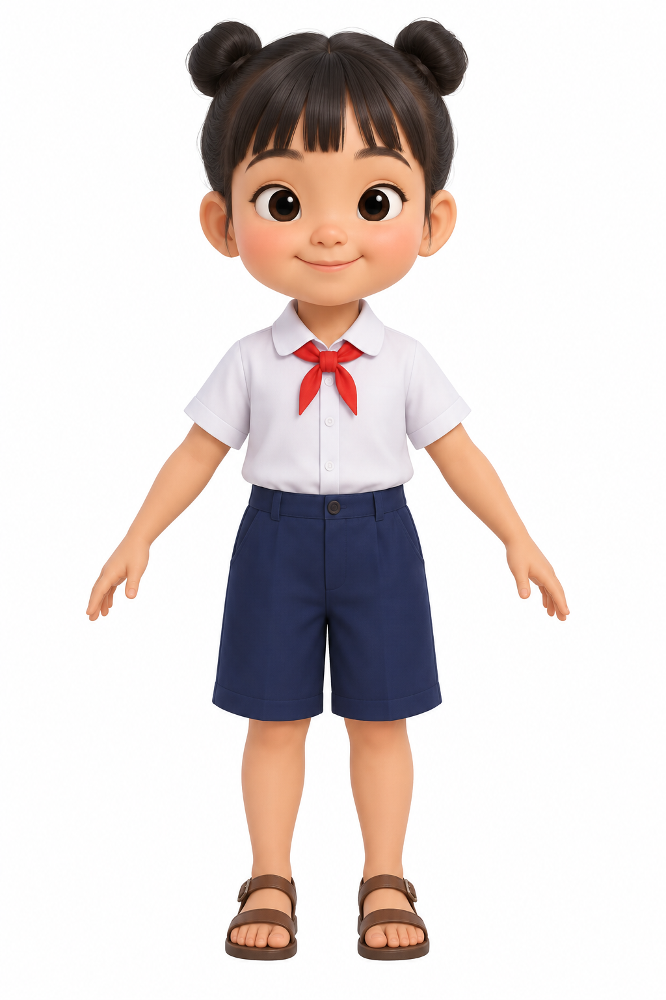
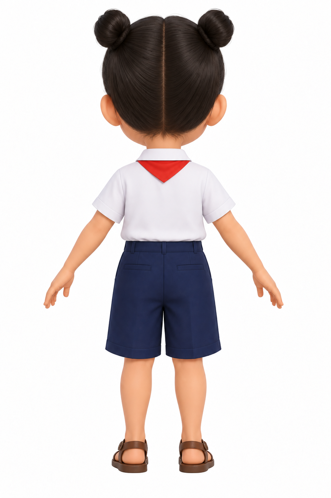
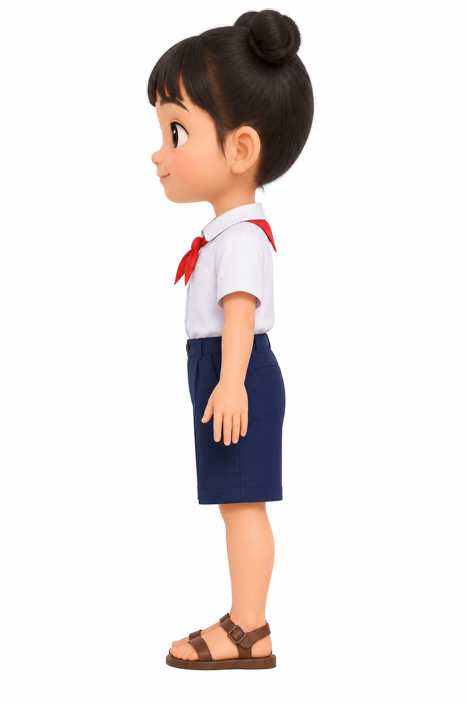
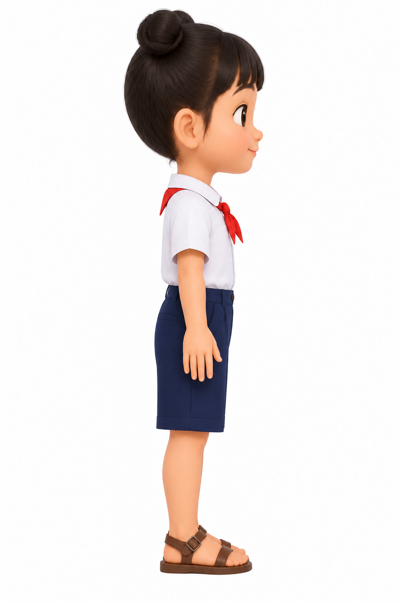
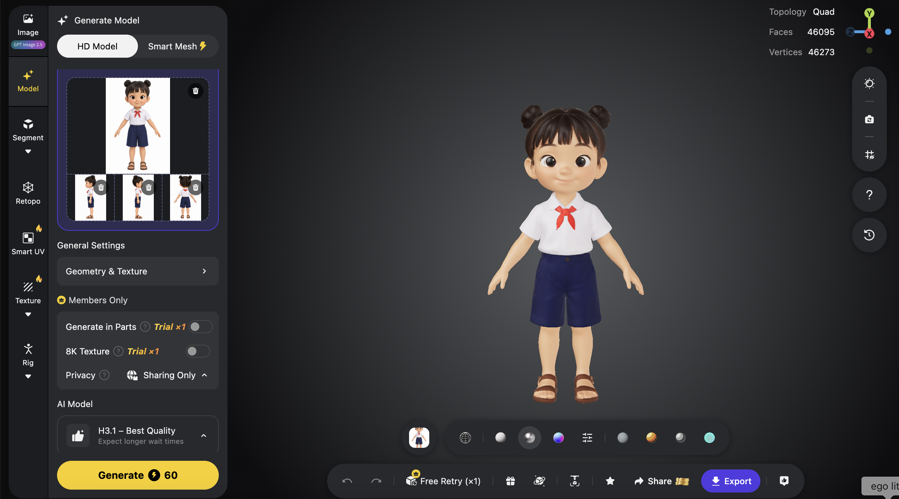
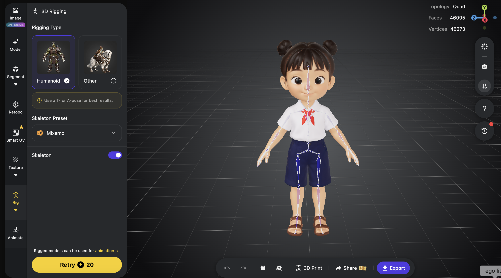

# Phụ lục B — Bộ mẫu thực hành nhanh

Các mẫu này gom những câu lệnh dùng lại nhiều lần. Thay nội dung trong `[ngoặc vuông]`; bỏ câu nào không đúng dự án. Sau mỗi prompt, hãy **mở bản thật và tự thử**, không chỉ đọc câu trả lời của agent.

## B1. Phiếu brief một trang

```text
Tên dự án: [tên]
Người xem: [ai]
Mục tiêu của người xem: [một hành động]
Asset đã có: [tên file + định dạng + tình trạng đã duyệt]
Bắt buộc: [tối đa ba điều]
Để sau: [tối đa ba điều]
Thiết bị cần thử: [desktop/điện thoại]
Đạt khi: [ba việc quan sát hoặc thao tác được]
```

## B2. Tạo dự án nhỏ

> Tôi mới bắt đầu và có brief này: `[dán brief]`. Hãy chọn bản đơn giản nhất có thể chạy trong trình duyệt. Trước khi sửa file, chia thành tối đa năm mốc và nói rõ tôi phải nhìn thấy gì sau mỗi mốc. Chỉ làm mốc đầu sau khi tôi duyệt. Nếu thiếu asset, nêu điều thiếu; đừng dùng ảnh giả rồi nói là đã hoàn thành.

**Thử:** mốc đầu mở được; thông điệp và thao tác chính nhìn thấy. **Lỗi:** gửi ảnh hoặc log theo B4.

## B3. Kiểm GLB trước khi lập trình

> Hãy đọc `[file].glb` và báo: kích thước, mesh/node, vật liệu/texture, skin/rig và clip animation. Với yêu cầu `[xe chạy/bánh quay/nhân vật đi]`, phân biệt phần làm được ngay với phần cần sửa/xuất lại asset. Chưa thay mô hình hoặc viết hiệu ứng cho đến khi báo cáo xong.

**Thử:** báo cáo có tên node/clip hoặc ghi rõ không có. **Lỗi:** nếu kết luận quá chung, yêu cầu bằng chứng từ cấu trúc file.

## B4. Báo một lỗi cụ thể

> Mong muốn: `[điều cần thấy]`. Thực tế: `[điều đã thấy]`. Cách tái hiện: `[các bước]`. Bằng chứng: `[ảnh/log/video]`. Thay đổi gần nhất: `[việc vừa làm]`. Hãy tìm nguyên nhân theo dữ kiện, sửa nhỏ nhất có thể, giữ `[phần đã đúng]`, chạy lại các bước trên và báo kết quả.

**Thử:** lặp đúng các bước tái hiện; kiểm thêm phần đã đúng. **Lỗi:** nếu ba lần chưa tiến bộ, dừng sửa và xem lại giả định/asset.

## B5. Hero video một cảnh

> Xây hero cho `[chủ đề]` với `hero.mp4` làm video nền im lặng và `poster.jpg` làm ảnh chờ. Tiêu đề `[text]`, mô tả `[text]`, CTA `[nhãn + đích thật]` là HTML. Giữ chữ đọc được suốt video, điện thoại không cắt mất chủ thể, người chọn giảm chuyển động xem poster tĩnh. Chỉ làm hero trước; mở preview và thử video, poster, CTA, desktop và màn hẹp.

**Thử:** tải lại, tắt video, bấm CTA, thử màn hẹp. **Lỗi:** ghi giây cụ thể khiến chữ chìm hoặc vùng bị cắt.

## B6. Kiểm trước khi chia sẻ

> Hãy kiểm bản dự án hiện tại trên desktop và điện thoại: nội dung, asset tải được, thao tác chính, CTA, tốc độ cảm nhận, fallback và thông tin nhạy cảm. Lập bảng đã đạt/chưa đạt/chưa thể kiểm. Chỉ sửa lỗi chặn người dùng hoàn thành hành động chính. Sau đó cho tôi biết link nào người khác có thể mở được; đừng gọi localhost là link công khai.

**Thử:** mở link từ thiết bị/trình duyệt khác. **Lỗi:** nếu file lỗi chỉ ở bản chia sẻ, kiểm đường dẫn asset và cấu hình phát hành.

## B7. Checklist bốn ảnh cho Tripo

- [ ] Cùng một đối tượng, cùng màu và phụ kiện ở trước/sau/trái/phải.
- [ ] Mỗi ảnh một góc rõ, toàn thân/toàn xe, nền sạch.
- [ ] Không có chữ, tay/chân/bánh bị cắt hoặc chi tiết che khuất lớn.
- [ ] Đặt bốn ảnh cạnh nhau và đánh dấu chi tiết không nhất quán.
- [ ] Duyệt preview nhiều góc trước khi xuất GLB; kiểm rig/clip riêng.

## B8. Nâng Mira từ di chuyển cả khối sang chạy có khớp

> Đây là repo Mira và GLB mới sau khi Auto Rig. Hãy liệt kê skeleton, skin và tên các clip có thật. Giữ bản GLB cũ làm dự phòng. Nếu GLB có clip phù hợp, thử phát động tác đứng, chạy và đánh; nếu không có clip, dùng bộ xương để dựng bản thử chuyển động như repo Mira hiện tại và ghi rõ cách làm. Kiểm khi bắt đầu chạy, đổi hướng và dừng: chân không trượt, bốt không xuyên nền, áo và túi không kéo méo. Mở localhost, cho tôi xem ba trạng thái ở cùng góc camera. Chưa sửa quái và bối cảnh.

**Thử:** đứng → chạy → dừng → chém. **Lỗi:** nếu không có clip, phải nói rõ chuyển động được tạo bằng mã trên bộ xương; đừng gọi chuyển động cả khối là chạy có khớp.

## B9. Nâng một loại quái

> Trong game Mira, hãy xem ảnh concept quái tôi gửi và chọn **một** loại quái hiện tại để nâng cấp hình ảnh. Giữ nguyên máu, tốc độ, thời điểm xuất hiện và kiểu tấn công. Đề xuất giữ hình khối Three.js hay tạo GLB riêng, giải thích lựa chọn bằng việc quái có đọc rõ ở góc camera đang chơi không. Làm một bản thử và mở localhost để tôi so trước/sau.

**Thử:** nhận ra quái khi nó còn ở xa và khi nhiều con cùng xuất hiện. **Lỗi:** nếu model đẹp nhưng khó thấy, chỉnh hình/màu trước khi tăng chi tiết.

## B10. Đồng bộ một chiêu phép

> Hãy kiểm riêng chiêu Tia Linh Quang của Mira theo ba lớp: luật trúng đích, tư thế nhân vật và hiệu ứng hình/âm. Giữ nguyên sát thương và thời gian hồi. Khi bấm, tư thế và tia sáng phải xuất hiện đúng lúc; quái mất máu khi tia chạm. Hiệu ứng không được che vòng cảnh báo nguy hiểm. Thử với quái đứng gần và quái đang di chuyển; báo điều đã kiểm.

**Thử:** quan sát lúc bấm, tia chạm, thanh máu quái và lúc chiêu sẵn sàng lại. **Lỗi:** nếu ảnh và luật lệch thời điểm, sửa đồng bộ trước khi thêm hạt hoặc ánh sáng.

## B11. Bài tập mới — Làng Vui Học 3D

**Làng Vui Học 3D** là ý tưởng game giáo dục: trẻ đi cùng nhân vật Bông qua một ngôi làng nhỏ, trò chuyện với người dân và giải nhiệm vụ ngắn để mở tiếp câu chuyện. Ví dụ, một quầy hàng có thể nhờ đếm đúng số quả; thư viện có thể nhờ ghép từ; bến xe có thể cho chọn biển chỉ đường. Mỗi nhiệm vụ cần gắn với **một mục tiêu học tập rõ**, có phản hồi khi chọn đúng hoặc sai, và cho phép thử lại. Hình 3D làm việc khám phá thú vị hơn; bài học vẫn phải dễ hiểu nếu tắt hiệu ứng.

**Phạm vi demo này:** chỉ hoàn thiện **Bông, nhân vật nữ đầu tiên**, từ ảnh tham chiếu đến model có xương và hoạt ảnh. Nhân vật nam và màn chơi giáo dục là hướng mở rộng, chưa được minh họa bằng kết quả chơi thật trong bài này. Làm một nhân vật trước giúp kiểm quy trình, phong cách và chuyển động trước khi nhân đôi khối lượng công việc.

### B11.1. Tạo và duyệt bốn góc của Bông

Câu lệnh gốc để tạo ảnh mặt trước trong ChatGPT hoặc Claude (giữ nguyên để bạn sao chép):

```text
Create an image
Front view of "Bong", a cute 7-year-old Vietnamese girl, warm light-tan skin, big round dark-brown eyes, rosy chubby cheeks, short black hair with straight bangs and two small neat buns on top (no long hanging hair), Vietnamese primary school uniform: white short-sleeve shirt, small red scarf tied in a short tight knot at the neck, navy blue knee-length shorts, simple brown strap sandals.

Style: cute stylized 3D animated-film character, soft clay-like materials, smooth simple shapes, chibi proportions (head about 1/3 of body height), clean solid colors, no patterns, no text or logos.
Pose: neutral A-pose, arms straight and angled 45° down away from the body, open relaxed hands with fingers slightly apart, standing straight, feet parallel and hip-width apart (NOT wide stance), small visible gap between the legs, mouth closed with a gentle smile, looking straight ahead.
Camera: orthographic character turnaround view, camera at chest height, full body from head to toes, character centered, same scale as reference.
Background: plain pure white, soft even studio lighting, no floor shadow, no props, nothing held in hands.
```

Khi ảnh trước đạt, **đính kèm chính ảnh đó** và yêu cầu từng góc còn lại. Dùng câu lệnh sau ba lần, lần lượt thay `[BACK / LEFT PROFILE / RIGHT PROFILE]`; mỗi lần chỉ tạo **một ảnh riêng**, không ghép thành poster:

```text
Use the approved front-view image of Bong as the exact character reference. Create one full-body [BACK / LEFT PROFILE / RIGHT PROFILE] orthographic turnaround image of the SAME girl. Preserve her age, proportions, two small hair buns, white short-sleeve shirt, short red scarf, navy knee-length shorts and brown strap sandals. Keep a neutral A-pose, feet parallel, identical camera height and character scale, pure white background and even studio lighting. Show the entire body from hair to sandals. No new accessories, text, collage or perspective angle.
```

| Trước | Sau | Trái | Phải |
|---|---|---|---|
|  |  |  |  |

*Hình B11.1 — Bốn ảnh tham chiếu thật của Bông do tác giả cung cấp. So tóc búi, khăn quàng đỏ, chiều dài quần và quai dép ở cả bốn góc trước khi dựng 3D.*

**Bạn được đổi ảnh.** Nếu một góc làm tóc, trang phục hoặc tỉ lệ thay đổi, hãy tạo lại **góc sai** với ảnh mặt trước đã duyệt làm chuẩn. Chỉ nạp vào Tripo khi bốn ảnh mô tả cùng một nhân vật; ảnh đẹp đơn lẻ chưa đủ.

### B11.2. Từ ảnh sang model trong Tripo

1. Trong Tripo, chọn tạo model từ **nhiều góc ảnh (multi-view)**. Nạp đúng ảnh trước, sau, trái và phải vào từng vị trí; kiểm lại nhãn trước khi bấm tạo.
2. Xoay preview để xem hai bên mặt, búi tóc, khăn quàng, bàn tay và hai chiếc dép. Nếu chi tiết bị dính hoặc mất, sửa ảnh tham chiếu rồi thử lại; đừng vội chuyển sang rig.
3. Nếu Tripo yêu cầu **Retopo** trước khi rig, xem preview lưới mới. Với nhân vật cần gập tay, chân, ưu tiên lưới phù hợp chuyển động và so ngoại hình trước/sau. Không có một số mặt cố định đúng cho mọi model.



*Hình B11.2 — Preview 3D thật của Bông trong Tripo. Model đã có hình khối và màu; ảnh này chưa chứng minh rằng xương hay clip hoạt ảnh đã nằm trong file xuất.*

### B11.3. Gắn xương, thử động tác, rồi kiểm file tải về

4. Vào **Rig**, chọn **Humanoid** vì Bông có cấu trúc người. Kiểm xương hông, vai, khuỷu tay, gối và cổ chân ở đúng vị trí. Chỉ bấm làm lại khi thấy lỗi cụ thể ở khớp hoặc vùng da bị kéo méo.
5. Vào **Animate** và thử từng động tác ngắn: **idle** (đứng), **walk** (đi), **run** (chạy), **jump** (nhảy), **wave** (vẫy tay), **cheer** (vui mừng). Với game giáo dục, động tác cần thân thiện, đọc rõ ở camera game, không cần thật nhiều chiêu phức tạp.
6. **Export GLB**, tải file về và lưu cùng bốn ảnh nguồn trong một thư mục dự án. Đặt tên dễ hiểu, ví dụ `bong-rigged.glb` và `bong-animations.glb`. Sau khi tải, nhờ agent kiểm **skin, số xương, tên và số clip thật trong từng GLB** trước khi đưa vào game.



*Hình B11.3 — Bông sau khi gắn xương trong Tripo. Các đường xương ở tay, thân và chân là bằng chứng của rig; muốn biết động tác đã được xuất hay chưa vẫn phải đọc file GLB.*

**Kết quả đã kiểm từ bộ file mẫu:** `bong_animations.glb` có một skin, 65 khớp xương và 7 clip, gồm đứng, đi, chạy, nhảy, vẫy tay, vui mừng và nhảy dây. Ngược lại, các file riêng được đặt tên `girl_idle.glb` hoặc `girl_walk.glb` trong thư mục mẫu có xương nhưng **không có clip**. Tên file không chứng minh nội dung bên trong. Bạn có thể nhận kết quả khác khi xuất từ Tripo; hãy luôn kiểm file của chính mình.

**Prompt giao file cho agent:**

> Tôi gửi bốn ảnh tham chiếu của Bông và các file GLB đã tải từ Tripo. Trước khi làm game, hãy lập bảng cho từng file: có mesh, texture, skin, bao nhiêu xương, bao nhiêu clip, tên từng clip và thời lượng. Chỉ dùng file thực sự có clip để thử đứng, đi, chạy và vẫy tay trong một cảnh nhỏ. Giữ đúng ngoại hình Bông; mở bản xem thử từ trước, bên và góc camera game. Nếu thiếu clip, báo rõ và dừng ở bước kiểm asset, không tự gọi file là đã animate.

**Bài tập ứng dụng giáo dục đầu tiên:** cho Bông đi từ cổng làng đến quầy hàng, chọn đúng **ba** quả trong một nhóm năm quả. Khi đúng, Bông vẫy tay và người chơi được đi tiếp; khi sai, trò chơi gợi ý đếm lại, không trừ điểm ngay. Đây là brief cho bước phát triển tiếp, **chưa phải tính năng được chứng minh bằng các ảnh Tripo bên trên**.

**Prompt cho màn chơi mẫu:**

> Dựa trên file Bông đã kiểm, tạo một màn web 3D rất nhỏ tên “Làng Vui Học 3D”. Chỉ có đường từ cổng làng đến quầy hàng, Bông đi bằng bàn phím hoặc nút chạm, và một nhiệm vụ đếm ba quả trong nhóm năm quả. Khi chọn đúng, phát động tác vui mừng nếu file có clip; khi sai, hiện gợi ý đếm lại. Chưa thêm đăng nhập, điểm thưởng hay màn thứ hai. Mở localhost và thử toàn bộ từ bắt đầu đến hoàn thành trên desktop và màn hình điện thoại.

**Đạt khi:** người mới có thể đối chiếu bốn ảnh, nhận ra model Tripo, chỉ đúng bộ xương, đọc được báo cáo clip thật và tự chơi hết nhiệm vụ đếm mẫu sau khi phát triển. Nếu chưa có màn chơi, kết quả hiện tại dừng ở **asset nhân vật**.
